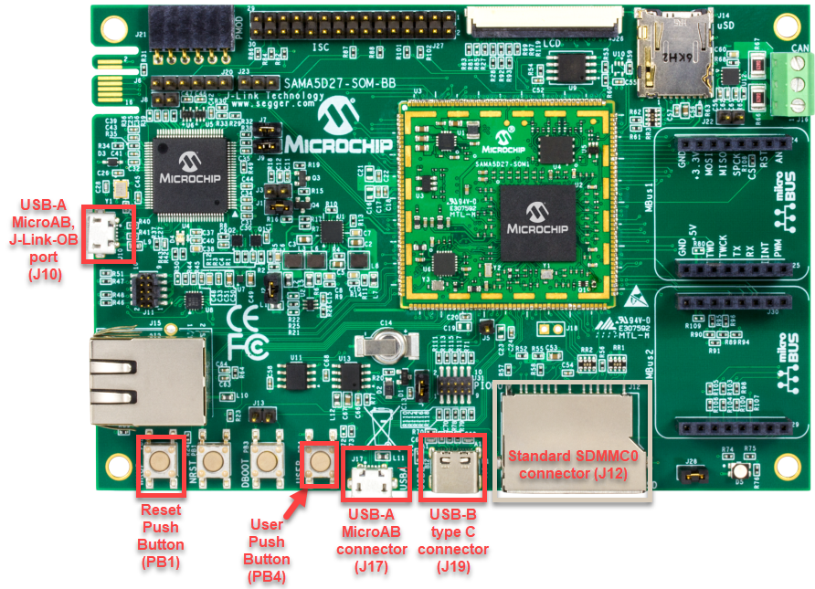
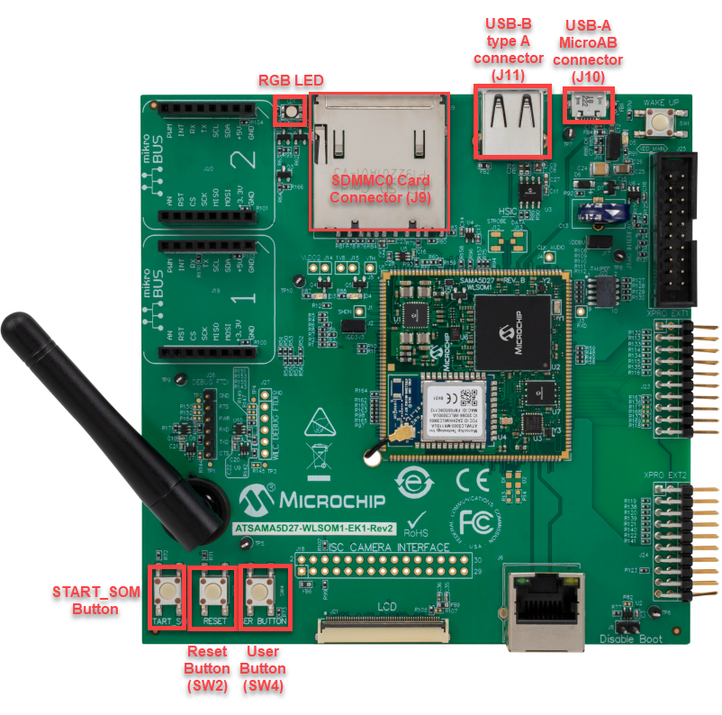
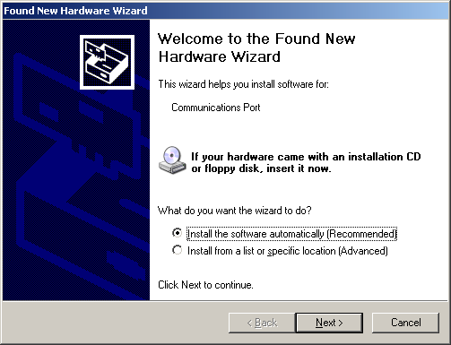
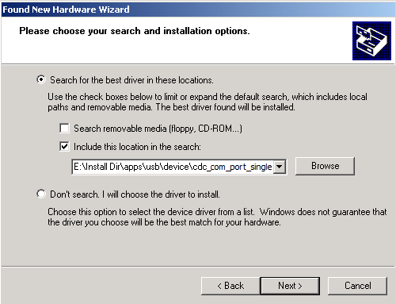

# CDC COM Port Single Example (cdc_com_port_single)

This application demonstrates the ability of the MPLAB Harmony USB Device Stack to support USB Communication Device Class. It demonstrates two-way communication between the USB device and the USB Host PC. 

## Description

This application creates a USB CDC Device that enumerates as a single COM port on the USB host PC. The COM port can be opened using any of the terminal applications. To demonstrate two-way communication, when a character is typed on the terminal window, it is echoed back by the USB device.

## Downloading and building the application

To clone or download this application from Github, go to the [main page of this repository](https://github.com/Microchip-MPLAB-Harmony/usb_apps_device) and then click **Clone** button to clone this repository or download as zip file.
This content can also be downloaded using content manager by following these [instructions](https://github.com/Microchip-MPLAB-Harmony/contentmanager/wiki).

Path of the application within the repository is [usb_apps_device/apps/cdc_com_port_single](https://github.com/Microchip-MPLAB-Harmony/usb_apps_device/apps/cdc_com_port_single).

Following table gives the details of project configurations, target device used, hardware and its IDE. Open the project using the respective IDE and build it. 

| Project Name                    | IDE    | Target Device       | Hardware / Configuration                                                   |
| ------------------------------- | ------ | ------------------- | -------------------------------------------------------------------------- |
| pic32cm_le00_curiosity_pro.X    | MPLABX | PIC32CM5164LE00100  | [PIC32CM Lx Curiosity Pro Board](#config_22)                               |
| pic32mm_usb_curiosity.X         | MPLABX | PIC32MM0256GPM064   | [PIC32MM USB Curiosity Development Board](#config_20)               |
| pic32mk_gp_db.X                 | MPLABX | PIC32MK1024GPE100   | [PIC32MK General Purpose (GP) Development Board](#config_12)               |
| pic32mk_gp_db_freertos.X        | MPLABX | PIC32MK1024GPE100   | [PIC32MK General Purpose (GP) Development Board](#config_12)               |
| pic32mx470_curiosity.X          | MPLABX | PIC32MX470F512H     | [PIC32MX Curiosity Development Board](#config_13)                          |
| pic32mx470_curiosity_freertos.X | MPLABX | PIC32MX470F512H     | [PIC32MX Curiosity Development Board](#config_13)                          |
| pic32mz_das_sk.X                | MPLABX | PIC32MZ2064DAS169   | [PIC32MZ Embedded Graphics with Stacked DRAM (DA) Starter Kit](#config_14) |
| pic32mz_ef_curiosity_2.X        | MPLABX | PIC32MZ2048EFM144   | [Curiosity PIC32MZ EF 2.0 Development Board](#config_15)                   |
| pic32mz_ef_sk.X                 | MPLABX | PIC32MZ2048EFH144   | [PIC32MZ Embedded Connectivity with FPU (EF) Starter Kit](#config_16)      |
| pic32mz_ef_sk_freertos.X        | MPLABX | PIC32MZ2048EFH144   | [PIC32MZ Embedded Connectivity with FPU (EF) Starter Kit](#config_16)      |
| pic32mz_w1_curiosity.X          | MPLABX | PIC32MZ1025W104132  | [Curiosity PIC32MZ W1 Development Board](#config_17)                       |
| sam_9x60_ek.X                   | MPLABX | SAM9X60             | [SAM9X60-EK Evaluation Board](#config_9)                                   |
| sam_9x60_ek_freertos.X                   | MPLABX | SAM9X60             | [SAM9X60-EK Evaluation Board](#config_9)                                   |
| sam_9x60_ek_iar.IAR             | IAR    | SAM9X60             | [SAM9X60-EK Evaluation Board](#config_9)                                   |
| sam_a5d2_xult.X           | MPLABX    | ATSAMA5D27C         | [SAMA5D2 Xplained Ultra Board](#config_10)                                |
| sam_a5d2_xult_freertos.X           | MPLABX   | ATSAMA5D27C         | [SAMA5D2 Xplained Ultra Board](#config_10)                                |
| sam_a5d2_xult_iar.IAR           | IAR    | ATSAMA5D27C         | [SAMA5D2 Xplained Ultra Board](#config_10)                                |
| sam_a5d27_som1_ek.X           | MPLABX    | ATSAMA5D27C         | [SAMA5D27 SOM1 Kit1](#config_18)                                |
| sam_a5d27_som1_ek_freertos.X           | MPLABX   | ATSAMA5D27C         | [SAMA5D27 SOM1 Kit1](#config_18)                                |
| sam_a5d27_wlsom1_ek1.X           | MPLABX    | ATSAMA5D27C         | [ATSAMA5D27 WLSOM1 EK1](#config_19)                                |
| sam_a5d27_wlsom1_ek1_freertos.X           | MPLABX   | ATSAMA5D27C         | [ATSAMA5D27 WLSOM1 EK1](#config_19)                                |
| sam_a7g5_ek.X                   | MPLABX | SAMA7G54            | [SAMA7G5 EK Board](#config_21)                                    |
| sam_d11_xpro.X                  | MPLABX | ATSAMD11D14A        | [SAMD11 Xplained Pro Board](#config_1)                                    |
| sam_d11_xpro_iar.IAR            | IAR    | ATSAMD11D14A        | [SAMD11 Xplained Pro Board](#config_1)                                    |
| sam_d21_xpro.X                  | MPLABX | ATSAMD21J18A        | [SAMD21 Xplained Pro Board](#config_2)                                    |
| sam_d21_xpro_iar.IAR            | IAR    | ATSAMD21J18A        | [SAMD21 Xplained Pro Board](#config_2)                                    |
| sam_da1_xpro.X                  | MPLABX | ATSAMDA1J16B        | [SAMDA1 Xplained Pro Board](#config_11)                                   |
| sam_e54_xpro.X                  | MPLABX | ATSAME54P20A        | [SAME54 Xplained Pro Board](#config_3)                                    |
| sam_e54_xpro_freertos.X         | MPLABX | ATSAME54P20A        | [SAME54 Xplained Pro Board](#config_3)                                    |
| sam_e54_xpro_iar.IAR            | IAR    | ATSAME54P20A        | [SAME54 Xplained Pro Board](#config_3)                                    |
| sam_e70_xult.X                  | MPLABX | ATSAME70Q21B        | [SAME70 Xplained Ultra Board](#config_4)                                  |
| sam_e70_xult_freertos.X         | MPLABX | ATSAME70Q21B        | [SAME70 Xplained Ultra Board](#config_4)                                  |
| sam_e70_xult_iar.IAR            | IAR    | ATSAME70Q21B        | [SAME70 Xplained Ultra Board](#config_4)                                  |
| sam_g55_xpro.X                  | MPLABX | ATSAMG55J19         | [SAMG55 Xplained Pro Board](#config_6)                                    |
| sam_l21_xpro.X                  | MPLABX | ATSAML21J18B        | [SAML21 Xplained Pro Board](#config_7)                                    |
| sam_l22_xpro.X                  | MPLABX | ATSAML22N18A        | [SAML22 Xplained Pro Board](#config_8)                                    |

##  Configuring the Hardware

###  [SAMD11 Xplained Pro Board](https://www.microchip.com/developmenttools/ProductDetails/atsamd11-xpro)

- Use TARGET USB connector on the board to connect the USB Device to the USB Host PC.
- LED0 indicates USB Device Configuration Set Complete event (the USB device functionality has been activated by the USB Host).
- Press the switch SW0 to trigger communication from the USB Device to the USB Host.

###  [SAMD21 Xplained Pro Board](https://www.microchip.com/developmenttools/ProductDetails/atsamd21-xpro)

- Use TARGET USB connector on the board to connect the USB Device to the USB Host PC.
- LED0 indicates USB Device Configuration Set Complete event (the USB device functionality has been activated by the USB Host).
- Press the switch SW0 to trigger communication from the USB Device to the USB Host.

###  [SAME54 Xplained Pro Board](https://www.microchip.com/developmenttools/productdetails/atsame54-xpro)

- Use TARGET USB connector on the board to connect the USB Device to the USB Host PC.
- LED0 indicates USB Device Configuration Set Complete event (the USB device functionality has been activated by the USB Host).
- Press the switch SW0 to trigger communication from the USB Device to the USB Host.

###  [SAME70 Xplained Ultra Board](https://www.microchip.com/DevelopmentTools/ProductDetails/PartNO/DM320113)

- Jumper J203 must be shorted between PB08 and VBUS (positions 2 and 3).
- Use TARGET USB J200 connector on the board to connect the USB Device to the USB Host PC.
- LED3 indicates USB Device Configuration Set Complete event (the USB device functionality has been activated by the USB Host).
- Press the switch SW1 to trigger communication from the USB Device to the USB Host.

###  [SAMG55 Xplained Pro Board](https://www.microchip.com/DevelopmentTools/ProductDetails/PartNO/ATSAMG55-XPRO)

- Use TARGET USB connector on the board to connect the USB Device to the USB Host PC.
- LED0 indicates USB Device Configuration Set Complete event (the USB device functionality has been activated by the USB Host).
- Press the switch SW0 to trigger communication from the USB Device to the USB Host.

###  [SAML21 Xplained Pro Board](https://www.microchip.com/developmenttools/ProductDetails/PartNO/ATSAML21-XPRO-B)

- Use TARGET USB connector on the board to connect the USB Device to the USB Host PC.
- LED0 indicates USB Device Configuration Set Complete event (the USB device functionality has been activated by the USB Host).
- Press the switch SW0 to trigger communication from the USB Device to the USB Host.

###  [SAML22 Xplained Pro Board](https://www.microchip.com/developmenttools/ProductDetails/PartNO/ATSAML22-XPRO-B)

- Use TARGET USB connector on the board to connect the USB Device to the USB Host PC.
- LED0 indicates USB Device Configuration Set Complete event (the USB device functionality has been activated by the USB Host).
- Press the switch SW0 to trigger communication from the USB Device to the USB Host.

###  [SAMDA1 Xplained Pro Board](https://www.microchip.com/developmenttools/ProductDetails/PartNO/ATSAMDA1-XPRO)

- Use TARGET USB connector on the board to connect the USB Device to the USB Host PC.
- LED0 indicates USB Device Configuration Set Complete event (the USB device functionality has been activated by the USB Host).
- Press the switch SW0 to trigger communication from the USB Device to the USB Host.

###  [Curiosity Pro PIC32CM LE00 Development Board](https://www.microchip.com/DevelopmentTools/ProductDetails/PartNO/TOBEADDED)

- Use the USB micro-A/B "TARGET USB" connector (D200) to connect the USB Device to the USB Host PC.
- LED0 indicates USB Device Configuration Set Complete event (the USB device functionality has been activated by the USB Host).
- Press the switch SW0 to trigger communication from the USB Device to the USB Host.

###  [PIC32MK General Purpose (GP) Development Board](https://www.microchip.com/developmenttools/ProductDetails/dm320106)

- Jumper J28 must be removed.
- Use the USB micro-B port J13 (which is located on the bottom side of the board) to connect the USB Device to the USB Host PC.
- LED1 indicates USB Device Configuration Set Complete event (the USB device functionality has been activated by the USB Host).
- Press the switch S1 to trigger communication from the USB Device to the USB Host.

###  [Curiosity PIC32MX470 Development Board](https://www.microchip.com/Developmenttools/ProductDetails/dm320103)

- Use the USB micro-B port J12 to connect the USB Device to the USB Host PC.
- LED1 indicates USB Device Configuration Set Complete event (the USB device functionality has been activated by the USB Host).
- Press the switch S1 to trigger communication from the USB Device to the USB Host.

###  [PIC32MZ Embedded Graphics with Stacked DRAM (DA) Starter Kit](https://www.microchip.com/DevelopmentTools/ProductDetails/DM320010-C)

- Use the micro-A/B port J6 (which is located on the bottom side of the board) to connect the USB Device to the USB Host PC.
- LED1 indicates USB Device Configuration Set Complete event (the USB device functionality has been activated by the USB Host).
- Press the switch SW1 to trigger communication from the USB Device to the USB Host.

###  [Curiosity PIC32MZ EF 2.0 Development Board](https://www.microchip.com/Developmenttools/ProductDetails/DM320209)

- Use the USB micro-B port J201 to connect the USB Device to the USB Host PC.
- LED1 indicates USB Device Configuration Set Complete event (the USB device functionality has been activated by the USB Host).
- Press the switch SW1 to trigger communication from the USB Device to the USB Host.

###  [PIC32MZ Embedded Connectivity with FPU (EF) Starter Kit](https://www.microchip.com/Developmenttools/ProductDetails/DM320007)

- Use the micro-A/B port J4 (which is located on the bottom side of the board) to connect the USB Device to the USB Host PC.
- LED1 indicates USB Device Configuration Set Complete event (the USB device functionality has been activated by the USB Host).
- Press the switch SW1 to trigger communication from the USB Device to the USB Host.

###  [Curiosity PIC32MZ W1 Development Board](https://www.microchip.com/DevelopmentTools/ProductDetails/PartNO/DM320104)

- Use the USB micro-B port J204 to connect the USB Device to the USB Host PC.
- The LED D202 indicates USB Device Configuration Set Complete event (the USB device functionality has been activated by the USB Host).
- Press the switch SW200 to trigger communication from the USB Device to the USB Host.

###  [PIC32MM USB Curiosity Development Board](https://www.microchip.com/en-us/development-tool/dm320107)

- Use the micro-B USB connector USB2 on the board to connect the USB Device to the USB Host PC.
- LED1 indicates USB Device Configuration Set Complete event (the USB device functionality has been activated by the USB Host).
- Press the switch S1 to trigger communication from the USB Device to the USB Host.

###  [SAM9X60-EK Evaluation Board](https://www.microchip.com/developmenttools/ProductDetails/DT100126)

- Setup the SD card 
    - Download harmony MPU bootstrap loader from this [location](firmware/at91bootstrap_sam_9x60_ek.X/binaries/boot.bin).
    - Copy the downloaded boot loader binary (boot.bin) and generated application binary (harmony.bin) into the SD card.
    - Insert the SD card into the SDMMC connector J4 on the board.
    - Reset the board by pressing the Push Button SW3. 
- Jumpers J20, J21, and J13 must be open.
- Jumper J2 and J3 must be shorted.
- Connect the USB Micro-B port J22 on board to the computer using a micro USB cable (to enable the debug com port).
- Connect the USB Micro-B Connector (J7) on the board to the computer using a micro USB cable. 
- LED D1 indicates USB Device Configuration Set Complete event (The USB device functionality has been activated by the USB Host).
- Press the switch SW1 to trigger communication from the USB Device to the USB Host.
    

    **Note: Reset push button on SAM9X60 EK is labeled as SW3**

###  [SAMA5D2 Xplained Ultra Board](https://www.microchip.com/Developmenttools/ProductDetails/ATSAMA5D2C-XULT)
- Setup the SD card 
    - Download harmony MPU bootstrap loader from this [location](firmware/at91bootstrap_sam_a5d2_xult.X/binaries/boot.bin).
    - Copy the downloaded boot loader binary (boot.bin) and generated application binary (harmony.bin) into the SD card.
    - Insert the SD card into the SDMMC1 slot on the board.
    - Reset the board by pressing the Push Button BP3. 
- Short jumper JP2(DEBUG_DIS).
- Connect the EDBG USB Micro-B port J14 on the board to the computer using a micro USB cable.
- Use the "A5-USB-A" connector (J23 - Micro A/B connector) on the board to connect the USB device to the USB Host.
- RGB LED turning to Green indicates USB Device Configuration Set Complete event (The USB device functionality has been activated by the USB Host).
- Press PB_USER Switch to trigger communication from the USB Device to the USB Host.

###  [SAMA5D27 SOM1 Kit1](https://www.microchip.com/developmenttools/ProductDetails/atsama5d27-som1-ek1)

- Setup the SD card 
    - Download harmony MPU bootstrap loader from this [location](firmware/at91bootstrap_sam_a5d27_som1_ek.X/binaries/boot.bin).
    - Copy the downloaded boot loader binary (boot.bin) and generated application binary (harmony.bin) into the SD card.
    - Insert the SD card into the SDMMC0 slot (J12) on the board.
    - Reset the board by pressing the Push Button PB1. 
- Connect the Debug USB port (J10) on the board to the computer using a micro USB cable.
- Connect the USB Micro-B Connector (J17) on the board to the computer using a micro USB cable. 
- RGB LED turning to Green indicates USB Device Configuration Set Complete event (The USB device functionality has been activated by the USB Host).
- Press the pushbutton PB4 to trigger communication from the USB Device to the USB Host.
  

###  [ATSAMA5D27-WLSOM1 Evaluation Kit](https://www.microchip.com/DevelopmentTools/ProductDetails/PartNO/DM320117)

- Setup the SD card 
    - Download harmony MPU bootstrap loader from this [location](firmware/at91bootstrap_sam_a5d27_wlsom1_ek1.X/binaries/boot.bin).
    - Copy the downloaded boot loader binary (boot.bin) and generated application binary (harmony.bin) into the SD card.
    - Insert the SD card into the SDMMC0 Card Connector (J9) on the board.
    - Reset the board by pressing the Reset Button (SW2) 
- Connect the USB-A MicroAB connector (J10) on the board to the computer using a micro USB cable.
- Press the "START_SOM" button to activate board start-up.  
- RGB LED turning to Green indicates USB Device Configuration Set Complete event (The USB device functionality has been activated by the USB Host).
- Press the pushbutton SW4 to trigger communication from the USB Device to the USB Host.
  

###  [SAMA7G5-EK Evaluation Kit](https://www.microchip.com/DevelopmentTools/ProductDetails/PartNO/TOBEADDED)

- Powered the board with an external power supply (J1) or power supply the board by connecting J7 to the computer using a micro USB cable.
- Setup the SD card 
    - Download harmony MPU bootstrap loader from this [location](firmware/at91bootstrap_sam_a7g5_ek.X/build/binaries/boot.bin).
    - Copy the downloaded boot loader binary (boot.bin) and generated application binary (harmony.bin) into the SD card.
    - Insert the SD card into the SD Card Connector (J4) on the board.
    - Reset the board by pressing the Reset Button (nRST) 
- Press the "nSTART" button to activate board start-up.  
- Connect the USB MicroAB connector (J7) to the computer using an USB cable.
- RGB LED turning to Green indicates USB Device Configuration Set Complete event (The USB device functionality has been activated by the USB Host).
- Press the USER BUTTON SW1 to trigger communication from the USB Device to the USB Host.

## Running the Application

This demonstration creates a USB device that enumerates as a serial (COM) port on the host. Do the following to run this demonstration:

1. Open the project with appropriate IDE. Compile the project and program the target device.
1. Attach the device to the host. If the host is a personal computer and this is the first time you have plugged this device into the computer you may be prompted for a .inf file.

    

1. Select the "Install from a list or specific location (Advanced)" option. Navigate to the driver path available in the repo - *..\usb_apps_device\apps\cdc_com_port_single\inf*.

    

    **Note:** 
    1. To specifically select the driver, open the *Device Manager* and expand the Ports (COM & LPT) tab, and right click on *Update Driver Software*.

    1. The LEDs on the demonstration board will indicate the USB state of the device. Refer to the [Configuring the Hardware](#config_title) section for the selected target hardware. 

1. Once the device is successfully installed, open up a terminal program, such as HyperTerminal and select the appropriate COM port. Set the serial port settings as follows:
    - Baud : 9600
    - Data : 8 Bits
    - Parity : None
    - Stop : 1 Bit
    - Flow Control : None

1. Once connected to the device, there are two ways to run this example project:
    - Typing a key in the terminal window will result in the attached device echoing the next letter. Therefore, if the letter 'b' is pressed, the device will echo 'c'.
    - If the push button is pressed, the device will echo "PUSH BUTTON PRESSED" to the terminal window. Refer to **Configuring the Hardware** section to identify the switch to be pressed for the selected target board.