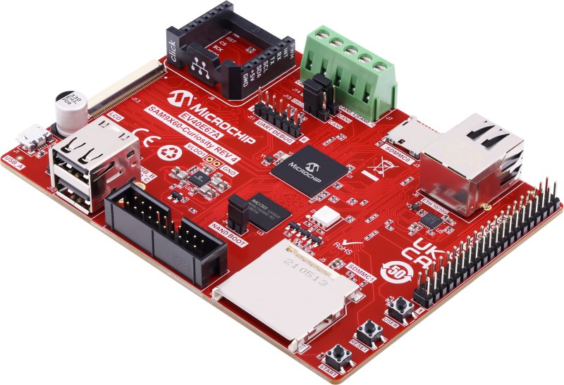
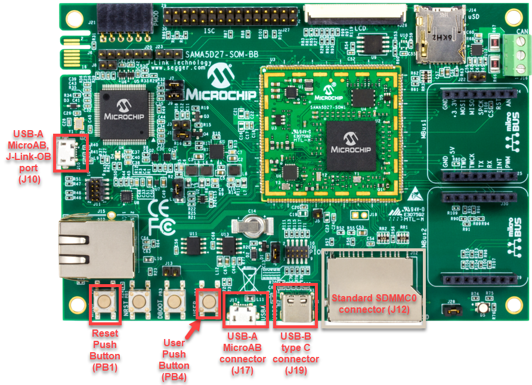

# CDC MSD SD Card Example (cdc_msd_sdcard)

This application demonstrates the ability of the MPLAB Harmony USB Device Stack to support composite USB Device. 

## Description

This application creates a USB CDC Device that enumerates as a COM port and Flash Drive simultaneously. The COM port can be opened using any of the terminal applications. To demonstrate two-way communication, a character typed on the terminal window is echoed back by the USB device. Flash drive acts similar to any Mass Storage Class device where the SD Card is used as storage media.

## Downloading and building the application

To clone or download this application from Github, go to the [main page of this repository](https://github.com/Microchip-MPLAB-Harmony/usb_apps_device) and then click **Clone** button to clone this repository or download as zip file.
This content can also be downloaded using content manager by following these [instructions](https://github.com/Microchip-MPLAB-Harmony/contentmanager/wiki).

Path of the application within the repository is [usb_apps_device/apps/cdc_msd_sdcard](https://github.com/Microchip-MPLAB-Harmony/usb_apps_device/tree/master/apps/cdc_msd_sdcard).

Following table gives the details of project configurations, target device used, hardware and its IDE. Open the project using the respective IDE and build it. 

| Project Name                    | IDE    | Target Device       | Hardware / Configuration                                                   |
| ------------------------------- | ------ | ------------------- | -------------------------------------------------------------------------- |
| pic32mx470_curiosity.X          | MPLABX | PIC32MX470F512H     | [PIC32MX Curiosity Development Board](#config_13)                          |
| pic32mz_ef_curiosity_2_0.X      | MPLABX | PIC32MZ2048EFM144   | [Curiosity PIC32MZ EF 2.0 Development Board](#config_15)                   |
| sam_9x60_ek.X                   | MPLABX | SAM9X60             | [SAM9X60-EK Evaluation Board](#config_9)                                   |
| sam_9x60_curiosity.X            | MPLABX | SAM9X60             | [SAM9X60 Curiosity Development Board](#config_sam9x60_curiosity)           |
| sam_a5d2_xult.X                 | MPLABX | ATSAMA5D27C         | [SAMA5D2 Xplained Ultra Board](#config_10)                                 |
| sam_a5d27_som1_ek.X             | MPLABX | ATSAMA5D27C         | [SAMA5D27 SOM1 Kit1](#config_18)                                           |
| sam_a5d27_wlsom1_ek1.X          | MPLABX | ATSAMA5D27C         | [ATSAMA5D27 WLSOM1 EK1](#config_19)                                        |
| sam_a7g5_ek.X                   | MPLABX | SAMA7G54            | [SAMA7G5 EK Board](#config_21)                                             |
| pic32cz_ca80_curiosity_ultra.X  | MPLABX | PIC32CZ8110CA80208  | [PIC32CZ Curiosity Development Board](#config_23)                          |

##  Configuring the Hardware

###  [SAM9X60-EK Evaluation Board](https://www.microchip.com/developmenttools/ProductDetails/DT100126)

- Setup the SD card 
    - Download harmony MPU bootstrap loader from this [location](firmware/at91bootstrap_sam_9x60_ek.X/build/binaries/boot.bin).
    - Copy the downloaded boot loader binary (boot.bin) and generated application binary (harmony.bin) into the SD card.
    - Insert the SD card into the SDMMC connector J4 on the board.
    - Reset the board by pressing the Push Button SW3. 
- Jumpers J20, J21, and J13 must be open.
- Jumper J2 and J3 must be shorted.
- Connect the USB Micro-B port J22 on board to the computer using a micro USB cable (to enable the debug com port).
- Connect the USB Micro-B Connector (J7) on the board to the computer using a micro USB cable. 
- LED D1 indicates USB Device Configuration Set Complete event (The USB device functionality has been activated by the USB Host).
- Press the switch SW1 to trigger communication from the USB Device to the USB Host.
    

    **Note: Reset push button on SAM9X60 EK is labeled as SW3**

###  [SAM9X60-Curiosity Board](https://www.microchip.com/en-us/development-tool/EV40E67A)
- Setup the SD card 
    - Download harmony MPU bootstrap loader from this [location](firmware/at91bootstrap_sam_9x60_curiosity.X/build/binaries/boot.bin).
    - Copy the downloaded boot loader binary (boot.bin) and generated application binary (harmony.bin) into the SD card.
    - Insert the SD card into the SDMMC0 connector J3 on the board.
    - Reset the board by pressing the Push Button "RESET". 
- Jumper J4 must be shorted.
- Connect the USB Micro-B Connector (J1) on the board to the computer using a micro USB cable. 
- LED D1 indicates USB Device Configuration Set Complete event (The USB device functionality has been activated by the USB Host).
- Press the switch "USER" to trigger communication from the USB Device to the USB Host.
    

###  [SAMA5D2 Xplained Ultra Board](https://www.microchip.com/Developmenttools/ProductDetails/ATSAMA5D2C-XULT)
- Setup the SD card 
    - Download harmony MPU bootstrap loader from this [location](firmware/at91bootstrap_sam_a5d2_xult.X/build/binaries/boot.bin).
    - Copy the downloaded boot loader binary (boot.bin) and generated application binary (harmony.bin) into the SD card.
    - Insert the SD card into the SDMMC1 slot on the board.
    - Reset the board by pressing the Push Button BP3. 
- Short jumper JP2(DEBUG_DIS).
- Connect the EDBG USB Micro-B port J14 on the board to the computer using a micro USB cable.
- Use the "A5-USB-A" connector (J23 - Micro A/B connector) on the board to connect the USB device to the USB Host.
- RGB LED turning to Green indicates USB Device Configuration Set Complete event (The USB device functionality has been activated by the USB Host).
- Press PB_USER Switch to trigger communication from the USB Device to the USB Host.

###  [Curiosity PIC32MX470 Development Board](https://www.microchip.com/Developmenttools/ProductDetails/dm320103)

- To run the demo, the following additional hardware is required:
    - [micro-sd Click](https://www.mikroe.com/microsd-click) board
    - micro-sd card
- Insert the micro-sd click board into the Mikro BUS 1 connector on the Curiosity PIC32MX470 Development Board. 
- Insert the micro-SD card into the micro-SD Card slot of the micro-sd click board. 
- USB micro-B port J12 to connect the USB device to the USB Host PC.
- LED1 indicates USB Device Configuration Set Complete event (the USB device functionality has been activated by the USB Host).
- Press the switch S1 to trigger communication from the USB Device to the USB Host.

###  [Curiosity PIC32MZ EF 2.0 Development Board](https://www.microchip.com/Developmenttools/ProductDetails/DM320209)

- To run the demo, the following additional hardware is required:
    - [micro-sd Click](https://www.mikroe.com/microsd-click) board
    - micro-sd card
- Insert the micro-sd click board into the Mikro BUS 1 connector on the Curiosity PIC32MZ EF 2.0 Development Board. 
- Insert the micro-SD card into the micro-SD Card slot of the micro-sd click board. 
- Use the USB micro-B port J201 to connect the USB Device to the USB Host PC.
- LED1 indicates USB Device Configuration Set Complete event (the USB device functionality has been activated by the USB Host).
- Press the switch SW1 to trigger communication from the USB Device to the USB Host.

###  [SAMA5D27 SOM1 Kit1](https://www.microchip.com/developmenttools/ProductDetails/atsama5d27-som1-ek1)

- Setup the SD card 
    - Download harmony MPU bootstrap loader from this [location](firmware/at91bootstrap_sam_a5d27_som1_ek.X/build/binaries/boot.bin).
    - Copy the downloaded boot loader binary (boot.bin) and generated application binary (harmony.bin) into the SD card.
    - Insert the SD card into the SDMMC0 slot (J12) on the board.
    - Reset the board by pressing the Push Button PB1. 
- Connect the Debug USB port (J10) on the board to the computer using a micro USB cable.
- Connect the USB Micro-B Connector (J17) on the board to the computer using a micro USB cable. 
- RGB LED turning to Green indicates USB Device Configuration Set Complete event (The USB device functionality has been activated by the USB Host).
- Press the pushbutton PB4 to trigger communication from the USB Device to the USB Host.
  

###  [ATSAMA5D27-WLSOM1 Evaluation Kit](https://www.microchip.com/DevelopmentTools/ProductDetails/PartNO/DM320117)

- Setup the SD card 
    - Download harmony MPU bootstrap loader from this [location](firmware/at91bootstrap_sam_a5d27_wlsom1_ek1.X/build/binaries/boot.bin).
    - Copy the downloaded boot loader binary (boot.bin) and generated application binary (harmony.bin) into the SD card.
    - Insert the SD card into the SDMMC0 Card Connector (J9) on the board.
    - Reset the board by pressing the Reset Button (SW2) 
- Connect the USB-A MicroAB connector (J10) on the board to the computer using a micro USB cable.
- Press the "START_SOM" button to activate board start-up.  
- RGB LED turning to Green indicates USB Device Configuration Set Complete event (The USB device functionality has been activated by the USB Host).
- Press the pushbutton SW4 to trigger communication from the USB Device to the USB Host.
  

###  [SAMA7G5-EK Evaluation Kit](https://www.microchip.com/en-us/development-tool/EV21H18A)

- Powered the board with an external power supply (J1) or power supply the board by connecting J7 to the computer using a micro USB cable.
- Setup the SD card 
    - Download harmony MPU bootstrap loader from this [location](firmware/at91bootstrap_sam_a7g5_ek.X/build/binaries/boot.bin).
    - Copy the downloaded boot loader binary (boot.bin) and generated application binary (harmony.bin) into the SD card.
    - Insert the SD card into the SD Card Connector (J4) on the board.
    - Reset the board by pressing the Reset Button (nRST) 
- Press the "nSTART" button to activate board start-up.  
- Connect the USB MicroAB connector (J7) to the computer using an USB cable.
- RGB LED turning to Green indicates USB Device Configuration Set Complete event (The USB device functionality has been activated by the USB Host).
- Press the USER BUTTON SW1 to trigger communication from the USB Device to the USB Host.

###  PIC32CZ Curiosity Development Board

- To run the demo, the following additional hardware is required:
    - micro-sd card 
- Insert the SD card into the SD Card Connector (J600) on the board.
- Use the USB micro-B port J102 to connect the USB Device to the USB Host PC.
- LED0 indicates USB Device Configuration Set Complete event (the USB device functionality has been activated by the USB Host).
- Press the switch SW0 to trigger communication from the USB Device to the USB Host.

## Running the Application

This demonstration application creates a composite USB Device that works simultaneously as a CDC and as a MSD device. This application combines the functionality of the cdc_com_port_single and msd_sdcard demonstration applications into one device. 

Open the project with appropriate IDE. Compile the project and program the target device.

### Running the CDC Device

The CDC Device application is same as *cdc_com_port_single* demo. Refer to local documentation from [usb_apps_device/apps/cdc_com_port_single](..\..\apps\cdc_com_port_single\readme.md). The documentation is also available in the github path [usb_apps_device/apps/cdc_com_port_single](https://github.com/Microchip-MPLAB-Harmony/usb_apps_device/tree/master/apps/cdc_com_port_single).

### Running the MSD SD Card Device

The MSD Basic Device application is same as *msd_sdcard* demo. Refer to local documentation from [usb_apps_device/apps/msd_sdcard](..\..\apps\msd_sdcard\readme.md). The documentation is also available in the github path [usb_apps_device/apps/msd_sdcard](https://github.com/Microchip-MPLAB-Harmony/usb_apps_device/tree/master/apps/msd_sdcard).