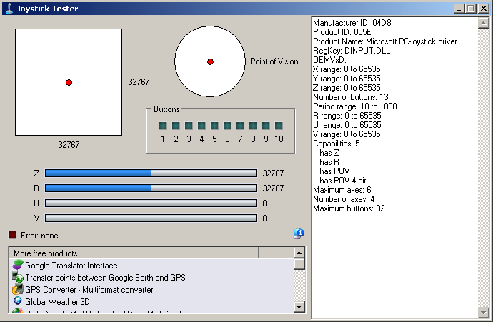

# HID Joystick Example (hid_joystick)

This application demonstrates the ability of the MPLAB Harmony USB Device Stack to support custom HID joystick. 

## Description

This demonstration application creates a custom HID joystick. This application is only intended to demonstrate creation of Joystick HID Report descriptors and may not be a definite end solution. The end application requirements may need the report descriptor to be modified.

## Downloading and building the application

To clone or download this application from Github, go to the [main page of this repository](https://github.com/Microchip-MPLAB-Harmony/usb_apps_device) and then click **Clone** button to clone this repository or download as zip file.
This content can also be downloaded using content manager by following these [instructions](https://github.com/Microchip-MPLAB-Harmony/contentmanager/wiki).

Path of the application within the repository is [usb_apps_device/apps/hid_joystick](https://github.com/Microchip-MPLAB-Harmony/usb_apps_device/tree/master/apps/hid_joystick).

Following table gives the details of project configurations, target device used, hardware and its IDE. Open the project using the respective IDE and build it. 

| Project Name                    | IDE    | Target Device       | Hardware / Configuration                                                   |
| ------------------------------- | ------ | ------------------- | -------------------------------------------------------------------------- |
| pic32mz_ef_curiosity_2_0.X      | MPLABX | PIC32MZ2048EFM144   | [Curiosity PIC32MZ EF 2.0 Development Board](#config_15)                   |
| pic32mx470_curiosity.X          | MPLABX | PIC32MX470F512H     | [PIC32MX Curiosity Development Board](#config_13)                          |
| sam_e70_xult.X                  | MPLABX | ATSAME70Q21B        | [SAM E70 Xplained Ultra Board](#config_4)                                  |
| sam_e70_xult_freertos.X         | MPLABX | ATSAME70Q21B        | [SAM E70 Xplained Ultra Board](#config_4)                                  |

##  Configuring the Hardware

###  [Curiosity PIC32MZ EF 2.0 Development Board](https://www.microchip.com/Developmenttools/ProductDetails/DM320209)

- Use the USB micro-B port J201 to connect the USB Device to the USB Host PC.
- LED1 indicates USB Device Configuration Set Complete event (the USB device functionality has been activated by the USB Host).
- Use Switch SW1 to stop and start the circular motion of the mouse pointer.

###  [Curiosity PIC32MX470 Development Board](https://www.microchip.com/Developmenttools/ProductDetails/dm320103)

- Use the USB micro-B port J12 to connect the USB Device to the USB Host PC.
- LED1 indicates USB Device Configuration Set Complete event (the USB device functionality has been activated by the USB Host).
- Press the switch S1 to trigger communication from the USB Device to the USB Host.

###  [SAME70 Xplained Ultra Board](https://www.microchip.com/DevelopmentTools/ProductDetails/PartNO/DM320113)

- Jumper J203 must be shorted between PB08 and VBUS (positions 2 and 3).
- Use TARGET USB J200 connector on the board to connect the USB Device to the USB Host PC.
- LED3 indicates USB Device Configuration Set Complete event (the USB device functionality has been activated by the USB Host).
- Use Switch SW1 to stop and start the circular motion of the mouse pointer.

## Running the Application

This demonstration uses the selected hardware platform as a USB Joystick. Open the project with appropriate IDE. Compile the project and program the target device.

The LED on the demonstration board will indicate the USB state of the device. Refer to the [Configuring the Hardware](#config_title) Section for details. 

Pressing the button will cause the device to:
- Indicate that the "x" button is pressed, but no others
- Move the hat switch to the "east" position
- Move the X and Y coordinates to their extreme values

    