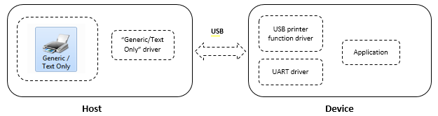
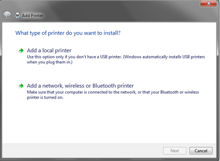
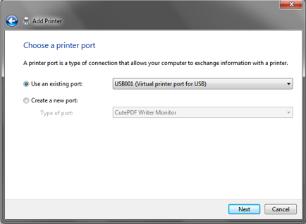
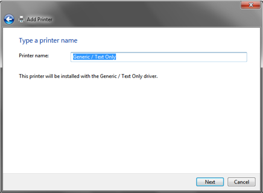
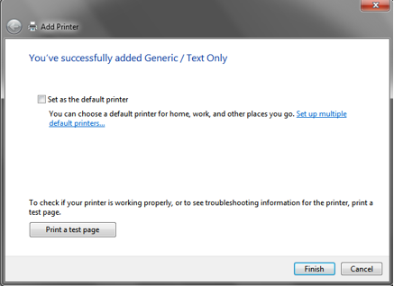
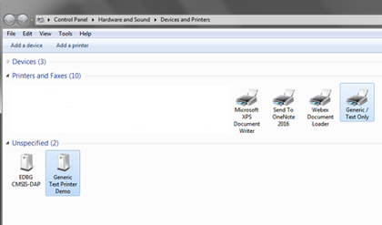
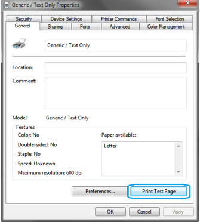
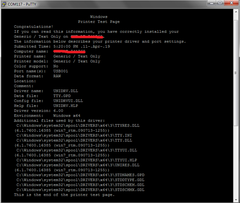

# Printer Example (printer)

This application demonstrates the ability of the MPLAB Harmony USB Device Stack to support Printer Device Class.

## Description

This demo uses PC running Windows 7 as a USB Host. The demo board programmed with the demo application, enumerates as "USB Printing Support" device when connected to the USB Host. This demo allows the user to print the text from Notepad or similar application in Windows using built in **Generic/Text Only** print driver.

## Downloading and building the application

To clone or download this application from Github, go to the [main page of this repository](https://github.com/Microchip-MPLAB-Harmony/usb_apps_device) and then click **Clone** button to clone this repository or download as zip file.
This content can also be downloaded using content manager by following these [instructions](https://github.com/Microchip-MPLAB-Harmony/contentmanager/wiki).

Path of the application within the repository is [usb_apps_device/apps/printer_basic](https://github.com/Microchip-MPLAB-Harmony/usb_apps_device/tree/master/apps/printer_basic).

Following table gives the details of project configurations, target device used, hardware and its IDE. Open the project using the respective IDE and build it. 

| Project Name                    | IDE    | Target Device       | Hardware / Configuration                                                   |
| ------------------------------- | ------ | ------------------- | -------------------------------------------------------------------------- |
| pic32mz_ef_curiosity_2_0.X      | MPLABX | PIC32MZ2048EFM144   | [Curiosity PIC32MZ EF 2.0 Development Board](#config_15)                   |
| sam_9x60_curiosity.X            | MPLABX | SAM9X60             | [SAM9X60 Curiosity Development Board](#config_sam9x60_curiosity) |

| sam_9x60_ek_iar.IAR             | IAR    | SAM9X60             | [SAM9X60-EK Evaluation Board](#config_9)                                   |
| sam_e54_xpro.X                  | MPLABX | ATSAME54P20A        | [SAME54 Xplained Pro Board](#config_3)                                    |
pic32cz_ca80_curiosity_ultra.X    | MPLABX | PIC32CZ8110CA80208  | [PIC32CZ Curiosity Development Board](#config_23)      
##  Configuring the Hardware

###  [Curiosity PIC32MZ EF 2.0 Development Board](https://www.microchip.com/Developmenttools/ProductDetails/DM320209)

- Use the USB micro-B port J201 to connect the USB Device to the USB Host PC.
- LED2 indicates USB Device Configuration Set Complete event (the USB device functionality has been activated by the USB Host).
- The CDC USB (UART to USB) interface on this board is served by the DEBUG_USB connector J700. Connecting this to the PC will create a COM port on the PC Host.

###  [SAM9X60-EK Evaluation Board](https://www.microchip.com/developmenttools/ProductDetails/DT100126)

- Setup the SD card 
    - Download harmony MPU bootstrap loader from this [location](firmware/at91bootstrap_sam_9x60_ek.X/build/binaries/boot.bin).
    - Copy the downloaded boot loader binary (boot.bin) and generated application binary (harmony.bin) into the SD card.
    - Insert the SD card into the SDMMC connector J4 on the board.
    - Reset the board by pressing the Push Button SW3. 
- Jumpers J20, J21, and J13 must be open.
- Jumper J2 and J3 must be shorted.
- Connect the USB Micro-B port J22 on board to the computer using a micro USB cable (to enable the debug com port). The USB COM port interface on this port is used to transfer demonstration application messages to a PC. 
- Connect the USB Micro-B Connector (J7) on the board to the computer using a micro USB cable.
- LED D1 indicates USB Device Configuration Set Complete event (The USB device functionality has been activated by the USB Host).
    

###  [SAM9X60-Curiosity Board](https://www.microchip.com/en-us/development-tool/EV40E67A)
- Setup the SD card 
    - Download harmony MPU bootstrap loader from this [location](firmware/at91bootstrap_sam_9x60_curiosity.X/build/binaries/boot.bin).
    - Copy the downloaded boot loader binary (boot.bin) and generated application binary (harmony.bin) into the SD card.
    - Insert the SD card into the SDMMC0 connector J3 on the board.
    - Reset the board by pressing the Push Button "RESET". 
- Jumper J4 must be shorted.
- Connect the USB Micro-B Connector (J1) on the board to the computer using a micro USB cable. 
- LED D1 indicates USB Device Configuration Set Complete event (The USB device functionality has been activated by the USB Host).
- Press the switch "USER" to trigger communication from the USB Device to the USB Host.
    

###  [SAME54 Xplained Pro Board](https://www.microchip.com/developmenttools/productdetails/atsame54-xpro)

- Use TARGET USB connector on the board to connect the USB Device to the USB Host PC.
- The CDC USB (UART to USB) interface on this board is served by the EDBG connector (DEBUG_USB). Connecting this to the PC will create a COM port on the PC Host.
- LED0 indicates USB Device Configuration Set Complete event (the USB device functionality has been activated by the USB Host).

###  PIC32CZ Curiosity Development Board

- Use the USB micro-B "USB DEVICE" connector (J102) to connect the USB Device to the USB Host PC.
- The CDC USB (UART to USB) interface on this board is served by the PKOB connector (DEBUG_USB). Connecting this to the PC will create a COM port on the PC Host.
- LED0 indicates USB Device Configuration Set Complete event (the USB device functionality has been activated by the USB Host).

## Running the Application

Generic / Text Only driver simply outputs the data to the connected USB printer in raw format without performing any translation on the data to be printed. 

There is no Printer head mechanism used in this demo, instead, the print data received from the host is sent to the serial terminal application running in the host itself by the demo application. 

Once the device is successfully installed, open up a terminal program, such as HyperTerminal and select the appropriate COM port. Set the serial port settings as follows:
- Baud : 115200
- Data : 8 Bits
- Parity : None
- Stop : 1 Bit
- Flow Control : None

    **Note:** Check the 'Device Manager' for the Virtual COM number associated with the EDBG. 

## Installing the printer

The demo board attached to the host PC enumerates as *USB Printing Support* in Device Manager as shown below. 

At this point, a new device by the name *Generic Text Printer Demo* should be available under Control Panel -> Devices and Printers as shown below. 

Follow the below steps to add *Generic/Text Only* printer and link it to the attached USB printer. 
 
1. Open Devices and Printers from the Control Panel and right click then click *Add a printer*

2. In the Add Printer wizard, click *Add a local printer*. 

3. In the printer port selection option, choose *Use an existing port* and from the drop-down list, select *USB00x (Virtual printer port for USB)*. 

4. In the printer driver selection, select *Generic* from the Manufacturer list and *Generic / Text Only* from the Printers list. 

5. Use the default option in driver version select window and click Next. 

6. In the printer name window, use the default name *Generic / Text Only* or provide any other name and click Next. 

7. Click Finish to complete the Add printer wizard. 

8. At this point, a new printer icon with the name provided in step #6 should be visible under Devices and Printers window as shown below. 

# Print test page

After successful installation of the *Generic / Text Only* printer, follow below steps to print a test page. 

1. On the printer icon, right click and select "Printer Properties" 
2. In the properties window, click "Print Test Page" as shown below.

    
    

3. Now the test page data will be printed on the serial terminal application as shown below. This shows the successful reception of print data sent by the host PC. 

    
