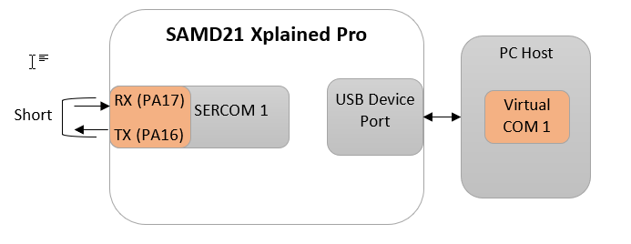

# USB UART Bridge Single Channel Example (usb_usart_bridge_single)

This application demonstrates the ability of the MPLAB® Harmony USB Device Stack to support the CDC Device Class using a real-world application. It implements a USB-USART Bridge application. 

## Description

This application demonstrates the use of the CDC device class to implement a USB-UART bridge. The application enumerates as a COM port on the personal computer. Any data sent through the virtual COM port will be seen at the respective UART port Tx pin and data sent through the UART Rx pin of the MCU will be seen at the virtual COM port.

## Downloading and building the application

To clone or download this application from Github, go to the [main page of this repository](https://github.com/Microchip-MPLAB-Harmony/usb_apps_device) and then click the **Clone** button to clone this repository or download it as a zip file.
This content can also be downloaded using the MPLAB® Harmony Content Manager by following these [instructions](https://github.com/Microchip-MPLAB-Harmony/contentmanager/wiki).

The path of the application within the repository is [usb_apps_device/apps/usb_usart_bridge_single](https://github.com/Microchip-MPLAB-Harmony/usb_apps_device/tree/master/apps/usb_uart_bridge_single).

The following table gives the details of project configurations, target device used, hardware, and its IDE. Open the project using the respective IDE and build it. 

| Project Name                    | IDE    | Target Device       | Hardware / Configuration                                                   |
| ------------------------------- | ------ | ------------------- | -------------------------------------------------------------------------- |
| sam_d21_xpro.X                  | MPLABX | ATSAMD21J18A        | [SAM D21 Xplained Pro board](#config_2)
| sam_e54_xpro.X                  | MPLABX | ATSAME54P20A        | [SAM E54 Xplained Pro Board](#config_3)                                    |

##  Configuring the Hardware

###  [SAM D21 Xplained Pro board](https://www.microchip.com/developmenttools/ProductDetails/atsamd21-xpro)

- Use the TARGET USB connector on the board to connect the USB device to the USB Host PC. 
- LED0 indicates USB Device Configuration Set Complete event (the USB device functionality has been activated by the USB Host). 
- Short the pins SERCOM1 USART TX (PA16) and SERCOM1 USART RX (PA17). These pins are available on the connector EXT2 pins 17 and 15 respectively.  

    
    

###  [SAM E54 Xplained Pro Board](https://www.microchip.com/developmenttools/productdetails/atsame54-xpro)

- Use the TARGET USB connector on the board to connect the USB device to the USB Host PC.
- LED0 indicates USB Device Configuration Set Complete event (the USB device functionality has been activated by the USB Host).
- Short the pins SERCOM0 USART TX (PA04) and SERCOM0 USART (PA05). These pins are available on the connector EXT1 pins 14 and 13 respectively. 

    
    

## Running the Application

This demonstration allows the device to appear like a serial (COM) port to the host. Do the following to run this demonstration:

1. Open the project with appropriate IDE. Compile the project and program the target device.

1. Attach the device to the host. If the host is a personal computer and this is the first time you have plugged this device into the computer, you may be prompted for a .inf file:

    

1. Select the "Install from a list or specific location (Advanced)" option. Specify the *..\usb_apps_device\apps\usb_uart_bridge_single\inf* directory.
    

    **Note:** To specifically select the driver, open the *device manager* and expand the Ports (COM & LPT) tab, and right click on *Update Driver Software*.

    

    Verify that the enumerated USB device is seen as a virtual USB serial comport in Device Manager.
    

1. Once the device is successfully installed, open an instance of a serial terminal program, such as HyperTerminal and select the appropriate COM port. Set the serial port settings as follows:
    - Baud : 9600
    - Data : 8 Bits
    - Parity : None
    - Stop : 1 Bit
    - Flow Control : None

    **Note:** The baud rate can different from 9600.

    

1. The LEDs on the demonstration board will indicate the USB state of the device. Refer to the [Configuring the Hardware](#config_title) section for the selected board for more details.
1. To run the demonstration, turn OFF the local echo on the serial terminal. For Tera Term terminal application, navigate to Setup->Terminal to turn OFF local echo. A character or string typed in the terminal window will be displayed on the same terminal as the Rx/Tx pins are shorted.

    
