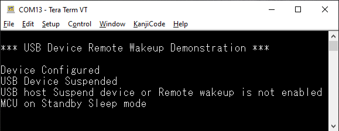
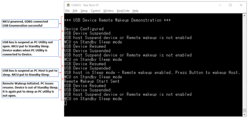

# HID Basic Remote Wakeup Example \(hid\_basic\_remote\_wakeup\)

This application demonstrates the ability of the MPLAB® Harmony USB Device Stack to<br /> support the Remote Wakeup feature using a custom HID device class example.

## **Description**

This application creates a USB HID Device that enumerates as a custom USB HID device<br /> on the USB host PC. The device allows the USB Host utility to control the LEDs on<br /> the board and query the status of a switch. This example demonstrates suspend/resume<br /> initiated by PC host and Remote Wakeup initiated by HID Device using a PC-based<br /> utility. The application will put the device to Standby sleep mode when it receives<br /> a suspend from PC host. The Push-button is used as wakeup source when the device<br /> goes to Standby sleep mode

## **Downloading and building the application**

To clone or download this application from Github, go to the [main page of this repository](https://github.com/Microchip-MPLAB-Harmony/usb_apps_device) and then click **Clone**<br /> button to clone this repository or download as zip file. This content can also be<br /> downloaded using the MPLAB® Harmony Content Manager by following these [instructions](https://github.com/Microchip-MPLAB-Harmony/contentmanager/wiki).

Path of the application within the repository is [usb\_apps\_device/apps/hid\_basic\_remote\_wakeup](https://github.com/Microchip-MPLAB-Harmony/usb_apps_device/tree/master/apps/hid_basic_remote_wakeup).

Following table gives the details of project configurations, target device<br /> used, hardware and its IDE. Open the project using the respective IDE and build<br /> it.

|Project Name|IDE|Target Device|Hardware / Configuration|
|------------|---|-------------|------------------------|
|sam\_e54\_xpro.X|MPLABX|ATSAME54P20A|SAM E54 Xplained Pro Board|
|sam\_l21\_xpro.X|MPLABX|ATSAML21J18B|SAML21 Xplained Pro Board|
|pic32cz\_ca80\_curiosity\_ultra.X|MPLABX|PIC32CZ8110CA80208|PIC32CZ CA80 Curiosity Ultra development board|

## **Configuring the Hardware**

**[PIC32CZ CA80 Curiosity Ultra development board](https://www.microchip.com/en-us/development-tool/ea61x20a)**

-   Connect the USB device to the micro-B connector \(J102\) using a USB Type-A Female to micro-B male cable \(This cable is not included in the kit\).
-   LED0 indicates USB Device Configuration Set Complete event \(the USB device functionality has been activated by the USB Host\).
-   Press the switch SW0 to trigger communication from the USB Device to the USB Host.
-   When the device is in Standby sleep, SW0 acts as wakeup source and brings the device to active mode. The device sends Remote wakeup to PC host and then goes back to Standby sleep mode to let the PC host drive the resume.

**[SAME54 Xplained Pro Board](https://www.microchip.com/developmenttools/productdetails/atsame54-xpro)**

-   Use TARGET USB connector on the board to connect the USB Device to the USB Host PC.
-   LED0 indicates USB Device Configuration Set Complete event \(the USB device functionality has been activated by the USB Host\).
-   Press the switch SW0 to trigger communication from the USB Device to the USB Host.
-   When the device is in Standby sleep, SW0 acts as wakeup source and brings the device to active mode. The device sends Remote wakeup to PC host and then goes back to Standby sleep mode to let the PC host drive the resume.
-   To measure current consumed by the device in different Sleep modes, refer to Section **Current Measurement Header** in [SAME54 Xplained Pro Hardware User Guide](https://ww1.microchip.com/downloads/en/DeviceDoc/70005321A.pdf). Refer to **Virtual COM Port** section to know more on using EDBG to send runtime messages.

**[SAML21 Xplained Pro Board](https://www.microchip.com/developmenttools/ProductDetails/PartNO/ATSAML21-XPRO-B)**

-   Use TARGET USB connector on the board to connect the USB Device to the USB Host PC.
-   LED0 indicates USB Device Configuration Set Complete event \(the USB device functionality has been activated by the USB Host\).
-   Press the switch SW0 to trigger communication from the USB Device to the USB Host.
-   When the device is in Standby sleep, SW0 acts as wakeup source and brings the device to active mode. The device sends Remote wakeup to PC host and then goes back to Standby sleep mode to let the PC host drive the resume.

## **Running the Application**

Runtime messages are sent through UART, which is received by EDBG and sent<br /> to PC terminal as USB CDC data. Follow the below steps to see the runtime<br /> messages.

1.  When the debug USB port is connected to the PC, it should be<br /> visible as a virtual COM port.

2.  Open up a terminal program, such as HyperTerminal and select the<br /> appropriate COM port. Set the serial port settings as follows:

    -   Baud : 115200
    -   Data : 8 Bits
    -   Parity : None
    -   Stop : 1 Bit
    -   Flow Control : None
3.  When the programming is complete and the application starts running, the title message will be seen.
4.  Connect the Upstream USB port to the PC and when the enumeration is successful, *__Device Configured__* message is seen. Since this is a HID device, PC host will suspend the device, unless an application is accessing it. The terminal window would now look like this.

## **HID Basic operation**

The HID Basic operation is same as *hid\_basic* demo. Refer to local<br /> documentation from [usb\_apps\_device/apps/hid\_basic](GUID-6CCEC174-DED4-48B5-8023-6BF721AA10D7.md). The documentation is also<br /> available in the github path [usb\_apps\_device/apps/hid\_basic](https://github.com/Microchip-MPLAB-Harmony/usb_apps_device/tree/master/apps/hid_basic).

## **Remote Wakeup, Suspend and Resume operation**

<br />

1.  To demonstrate the Remote wakeup capabilities along with the<br /> debug messages, the Upstream ports of target USB and debug USB should be<br /> connected to two different PC Hosts. This is shown below.

    

2.  When the PC utility is connected to the USB device, *__USB Device Resumed__* message is seen. Closing the application<br /> would *suspend* the USB device and the respective message will be<br /> seen.

3.  The suspend due to closure of PC utility will not enable the<br /> Remote Wakeup of USB device. Hence the message *__USB host Suspend device or Remote wakeup is not enabled__* would be seen.<br /> The device will be put to Standby Sleep mode.

4.  A resume from PC host can wake up the device and continue with<br /> HID operation. This is when *__USB Device Resumed__* message is<br /> shown.

5.  Put the PC host connected to Target USB port to sleep to test<br /> Remote wakeup. If the device is allowed to wake up PC host, then the<br /> Remote Wakeup will be enabled in the USB device by PC host before<br /> suspending the bus. This is shown through *__USB host in Sleep mode - Remote wakeup enabled. Press Button to wakeup Host.__*<br /> message.

6.  If the message *__USB host Suspend device or Remote wakeup is not enabled__* is seen when PC host is put to sleep, it<br /> means the USB device is not allowed to do Remote Wakeup. Go to the power<br /> settings of the USB device in PC host and enable Remote wakeup feature.<br /> This can be done in a Windows machine through device manager or command<br /> prompt.


<br />

``` {#CODEBLOCK_D23_VT2_TYB}
*** USB Device Remote Wakeup Demonstration ***

Device Configured
USB Device
      Suspended
USB host Suspend device or Remote wakeup is not enabled
MCU on Standby
      Sleep mode

```

<br />

-   On "PC Host 2",

    - launch in a command console with administrator privilege: powercfg<br /> -devicequery wake\_from\_any

    - Displays all devices that are connected to the PC. - search in the<br /> answer the ligne "HID-compliant vendor-defined device"

    - launch: powercfg -deviceenablewake "HID-compliant vendor-defined device<br /> \(002\)"

    It can be different. - Then - powercfg -devicequery wake\_armed - will<br /> return : "HID-compliant vendor-defined device \(002\)"

-   Put the "PC Host 2" on sleep


<br />

``` {#CODEBLOCK_F23_VT2_TYB}
USB Device Resumed
USB Device Suspended
USB host in Sleep mode - Remote wakeup
      enabled. Press Button to wakeup Host.
MCU on Standby Sleep mode

```

<br />

-   Press SW0

<br />

``` {#CODEBLOCK_H23_VT2_TYB}
Remote Wakeup Start Sent
USB Device Resumed
USB Device Suspended
USB host
      Suspend device or Remote wakeup is not enabled
MCU on Standby Sleep mode
USB Device
      Resumed
USB Device Suspended
USB host Suspend device or Remote wakeup is not
      enabled
MCU on Standby Sleep mode

```

<br />

-   The "PC Host 2" is resumed.

    If the Remote Wakeup is enabled and the device is put to<br /> sleep, press the switch to initiate a **Remote Wakeup**. The PC host<br /> will respond back with a resume and device will continue with its HID<br /> operation. The screenshot showing suspend, resume and remote wakeup<br /> operations are shown below.

    


<br />

**Parent topic:**[Harmony 3 USB Device application examples](GUID-90055758-897E-445A-8A8B-CE4EBF3930A7.md)

