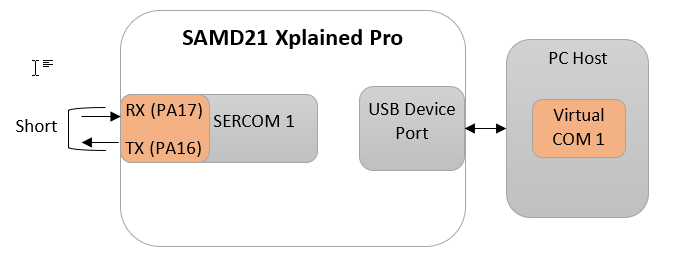
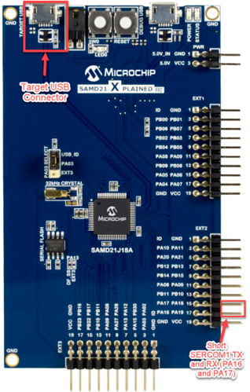
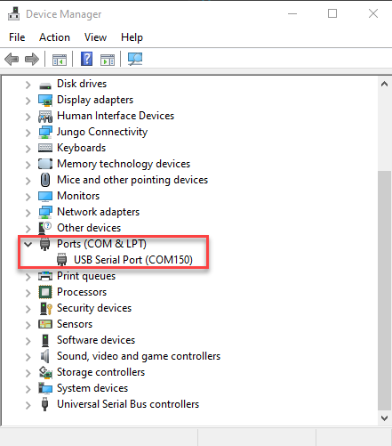

# USB UART Bridge Single Channel Example \(usb\_usart\_bridge\_single\)

This application demonstrates the ability of the MPLAB® Harmony USB Device Stack to support  the CDC Device Class using a real-world application. It implements a USB-USART Bridge  application.

## **Description**

This application demonstrates the use of the CDC device class to implement a USB-UART  bridge. The application enumerates as a COM port on the personal computer. Any data sent  through the virtual COM port will be seen at the respective UART port Tx pin and data sent  through the UART Rx pin of the MCU will be seen at the virtual COM port.

## **Downloading and building the application**

To clone or download this application from Github, go to the [main page of this repository](https://github.com/Microchip-MPLAB-Harmony/usb_apps_device) and then click the **Clone**  button to clone this repository or download it as a zip file. This content can also be  downloaded using the MPLAB® Harmony Content Manager by following these [instructions](https://github.com/Microchip-MPLAB-Harmony/contentmanager/wiki).

The path of the application within the repository is [usb\_apps\_device/apps/usb\_usart\_bridge\_single](https://github.com/Microchip-MPLAB-Harmony/usb_apps_device/tree/master/apps/usb_uart_bridge_single).

The following table gives the details of project configurations, target device  used, hardware, and its IDE. Open the project using the respective IDE and build it.

|Project Name|IDE|Target Device|Hardware / Configuration|
|------------|---|-------------|------------------------|
|sam\_d21\_xpro.X|MPLABX|ATSAMD21J18A|SAM D21 Xplained Pro board|
|sam\_e54\_xpro.X|MPLABX|ATSAME54P20A|SAM E54 Xplained Pro Board|

## **Configuring the Hardware**

**[SAM D21 Xplained Pro board](https://www.microchip.com/developmenttools/ProductDetails/atsamd21-xpro)**

-   Use the TARGET USB connector on the board to connect the USB device to the  USB Host PC.

-   LED0 indicates USB Device Configuration Set Complete event \(the USB device  functionality has been activated by the USB Host\).

-   Short the pins SERCOM1 USART TX \(PA16\) and SERCOM1 USART RX \(PA17\). These  pins are available on the connector EXT2 pins 17 and 15 respectively.

**[SAM E54 Xplained Pro Board](https://www.microchip.com/developmenttools/productdetails/atsame54-xpro)**

-   Use the TARGET USB connector on the board to connect the USB device to the  USB Host PC.

-   LED0 indicates USB Device Configuration Set Complete event \(the USB device  functionality has been activated by the USB Host\).

-   Short the pins SERCOM0 USART TX \(PA04\) and SERCOM0 USART \(PA05\). These pins  are available on the connector EXT1 pins 14 and 13 respectively.

## **Running the Application**

This demonstration allows the device to appear like a serial \(COM\) port to the  host. Do the following to run this demonstration:

1.  Open the project with appropriate IDE. Compile the project and program the  target device.

2.  Attach the device to the host. If the host is a personal computer and this is  the first time you have plugged this device into the computer, you may be prompted for a  .inf file:

3.  Select the "Install from a list or specific location \(Advanced\)" option. Specify the *..\\usb\_apps\_device\\apps\\usb\_uart\_bridge\_single\\inf* directory.
4.  Once the device is successfully installed, open an instance of a serial  terminal program, such as HyperTerminal and select the appropriate COM port. Set the  serial port settings as follows:

    -   Baud : 9600
    -   Data : 8 Bits
    -   Parity : None
    -   Stop : 1 Bit
    -   Flow Control : None
    **Note:** The baud rate can different from 9600.

5.  The LEDs on the demonstration board will indicate the USB state of the device. Refer to the [Configuring the Hardware](https://file+.vscode-resource.vscode-cdn.net/c%3A/H3_USB_APPS/usb_apps_device/apps/usb_uart_bridge_single/readme.md#config_title) section for the selected board for more details.
6.  To run the demonstration, turn OFF the local echo on the serial terminal. For  Tera Term terminal application, navigate to Setup-\>Terminal to turn OFF local echo. A  character or string typed in the terminal window will be displayed on the same terminal  as the Rx/Tx pins are shorted.

**Parent topic:**[Harmony 3 USB Device application examples](GUID-90055758-897E-445A-8A8B-CE4EBF3930A7.md)

