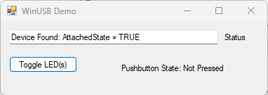

# Vendor Example \(vendor\)

This application demonstrates the ability of the MPLAB Harmony USB Device Stack to  support Vendor Device class.

## **Description**

This application creates a USB CDC Device that enumerates as a custom vendor USB  device on the USB host PC. The device uses USB Device Layer Endpoint functions and  demonstrates the PC host's ability to control the LEDs on the board and query the  status of a switch through PC utility.

## **Downloading and building the application**

To clone or download this application from Github, go to the [main page of this repository](https://github.com/Microchip-MPLAB-Harmony/usb_apps_device) and then click **Clone**  button to clone this repository or download as zip file. This content can also be  downloaded using content manager by following these [instructions](https://github.com/Microchip-MPLAB-Harmony/contentmanager/wiki).

Path of the application within the repository is [usb\_apps\_device/apps/vendor](https://github.com/Microchip-MPLAB-Harmony/usb_apps_device/tree/master/apps/vendor).

Following table gives the details of project configurations, target device  used, hardware and its IDE. Open the project using the respective IDE and build  it.

|Project Name|IDE|Target Device|Hardware / Configuration|
|------------|---|-------------|------------------------|
|pic32mz\_ef\_curiosity\_2\_0.X|MPLABX|PIC32MZ2048EFM144|Curiosity PIC32MZ EF 2.0 Development Board|
|pic32mx470\_curiosity.X|MPLABX|PIC32MX470F512H|PIC32MX Curiosity Development Board|
|pic32mz\_ef\_sk.X|MPLABX|PIC32MZ2048EFH144|PIC32MZ Embedded Connectivity with FPU \(EF\) Starter Kit|
|pic32mz\_ef\_sk\_freertos.X|MPLABX|PIC32MZ2048EFH144|PIC32MZ Embedded Connectivity with FPU \(EF\) Starter Kit|
|pic32mm\_usb\_curiosity.X|MPLABX|PIC32MM0256GPM064|PIC32MM USB Curiosity Development Board|
|sam\_9x60\_ek.X|MPLABX|SAM9X60|SAM9X60-EK Evaluation Board|
|sam\_9x60\_ek\_freertos.X|MPLABX|SAM9X60|SAM9X60-EK Evaluation Board|
|sam\_9x60\_curiosity.X|MPLABX|SAM9X60|SAM9X60 Curiosity Development Board|
|sam\_9x60\_curiosity\_freertos.X|MPLABX|SAM9X60|SAM9X60 Curiosity Development Board|
|sam\_9x75\_eb.X|MPLABX|SAM9X75|SAM9X75-DDR3-EB Evaluation Board|
|sam\_a5d2\_xult.X|MPLABX|ATSAMA5D27C|SAMA5D2 Xplained Ultra Board|
|sam\_a5d27\_som1\_ek.X|MPLABX|ATSAMA5D27C|SAMA5D27 SOM1 Kit1|
|sam\_a5d27\_wlsom1\_ek1.X|MPLABX|ATSAMA5D27C|ATSAMA5D27 WLSOM1 EK1|
|sam\_a7g5\_ek.X|MPLABX|SAMA7G54|SAMA7G5 EK Board|
|sam\_d21\_xpro.X|MPLABX|ATSAMD21J18A|SAMD21 Xplained Pro Board|
|sam\_e54\_xpro.X|MPLABX|ATSAME54P20A|SAME54 Xplained Pro Board|
|sam\_e54\_xpro\_freertos.X|MPLABX|ATSAME54P20A|SAME54 Xplained Pro Board|
|sam\_e70\_xult.X|MPLABX|ATSAME70Q21B|SAME70 Xplained Ultra Board|
|sam\_e70\_xult\_freertos.X|MPLABX|ATSAME70Q21B|SAME70 Xplained Ultra Board|
|sam\_g55\_xpro.X|MPLABX|ATSAMG55J19|SAMG55 Xplained Pro Board|
|sam\_v71\_xult.X|MPLABX|ATSAMV71Q21B|SAMV71 Xplained Ultra board|
|pic32cz\_ca80\_curiosity\_ultra.X|MPLABX|PIC32CZ8110CA80208|PIC32CZ CA80 Curiosity Ultra development board|
|pic32ck\_gc01\_curiosity\_ultra.X|MPLABX|PIC32CK2051GC01144|PIC32CK GC Curiosity Ultra Development Board|
|pic32cx\_sg41\_curiosity\_ultra.X|MPLABX|PIC32CX1025SG41128|PIC32CX SG41 Curiosity Ultra Evaluation Board|
|sam\_a5d29\_curiosity.X|MPLABX|ATSAMA5D29|SAMA5D29 Curiosity Development Board|
|sam\_9x75\_curiosity.X|MPLABX|SAM9X75D2G|SAM9X75-Curiosity Development Board|

## **Configuring the Hardware**

**[SAMD21 Xplained Pro Board](https://www.microchip.com/developmenttools/ProductDetails/atsamd21-xpro)**

-   Use TARGET USB connector on the board to connect the USB Device to the USB Host PC.
-   LED0 indicates USB Device Configuration Set Complete event \(the USB device functionality has been activated by the USB Host\).
-   Press the switch SW0 to trigger communication from the USB Device to the USB Host.

**[SAME54 Xplained Pro Board](https://www.microchip.com/developmenttools/productdetails/atsame54-xpro)**

-   Use TARGET USB connector on the board to connect the USB Device to the USB Host PC.
-   LED0 indicates USB Device Configuration Set Complete event \(the USB device functionality has been activated by the USB Host\).
-   Press the switch SW0 to trigger communication from the USB Device to the USB Host.

**[SAME70 Xplained Ultra Board](https://www.microchip.com/DevelopmentTools/ProductDetails/PartNO/DM320113)**

-   Jumper J203 must be shorted between PB08 and VBUS \(positions 2 and 3\).
-   Use TARGET USB J200 connector on the board to connect the USB Device to the USB Host PC.
-   LED3 indicates USB Device Configuration Set Complete event \(the USB device functionality has been activated by the USB Host\).
-   Press the switch SW400 to trigger communication from the USB Device to the USB Host.

**[SAMV71 Xplained Ultra board](https://www.microchip.com/DevelopmentTools/ProductDetails/PartNO/ATSAMV71-XULT)**

-   Jumper titled "USB VBUS" must be shorted between PC09 and VBUS \(positions 2 and 3\)
-   Use TARGET USB connector on the board to connect the USB Device to the USB Host PC.
-   LED0 indicates USB Device Configuration Set Complete event \(the USB device functionality has been activated by the USB Host\).

**[PIC32CZ CA80 Curiosity Ultra development board](https://www.microchip.com/en-us/development-tool/ea61x20a)**

-   Use the USB micro-B "USB DEVICE" connector \(J102\) to connect the USB Device to the USB Host PC.
-   LED0 indicates USB Device Configuration Set Complete event \(the USB device functionality has been activated by the USB Host\).
-   Press the switch SW0 to trigger communication from the USB Device to the USB Host.

**[PIC32CK GC Curiosity Ultra Development Board](https://www.microchip.com/en-us/development-tool/ea23j82a)**

-   Use the Barrel jack connector\(J200\) to connect an external power supply to the board.
-   Use the USB Type-C connector \(J202\) to connect the USB Device to the USB Host PC.
-   LED0 indicates USB Device Configuration Set Complete event \(the USB device functionality has been activated by the USB Host\).
-   Press the switch SW0 to trigger communication from the USB Device to the USB Host.

**__[PIC32CX SG41 Curiosity Ultra Evaluation Board](https://www.microchip.com/en-us/development-tool/EV06X38A)__**

-   Use the micro-B USB connector Target USB\( J200\) on the board to connect the USB Device to the USB Host PC.
-   LED1 indicates USB Device Configuration Set Complete event \(the USB device functionality has been activated by the USB Host\).
-   Press the switch SW1 to trigger communication from the USB Device to the USB Host.

**[SAMG55 Xplained Pro Board](https://www.microchip.com/DevelopmentTools/ProductDetails/PartNO/ATSAMG55-XPRO)**

-   Use TARGET USB connector on the board to connect the USB Device to the USB Host PC.
-   LED0 indicates USB Device Configuration Set Complete event \(the USB device functionality has been activated by the USB Host\).
-   Press the switch SW0 to trigger communication from the USB Device to the USB Host.

**[SAM9X60-EK Evaluation Board](https://www.microchip.com/developmenttools/ProductDetails/DT100126)**

-   Setup the SD card \(Note: exFAT formatted SD Cards are not  supported\)

    -   Download harmony MPU bootstrap loader from this [location](https://github.com/Microchip-MPLAB-Harmony/usb_apps_device/tree/master/deps/at91bootstrap_sam_9x60_binaries/boot.bin).
    -   Copy the downloaded boot loader binary \(boot.bin\) and generated application binary \(harmony.bin\) into the SD card.
    -   Insert the SD card into the SDMMC connector J4 on the board.
    -   Reset the board by pressing the Push Button SW3.
-   Jumpers J20, J21, and J13 must be open.

-   Jumper J2 and J3 must be shorted.

-   Connect the USB Micro-B port J22 on board to the computer using  a micro USB cable \(to enable the debug com port\).

-   Connect the USB Micro-B Connector \(J7\) on the board to the  computer using a micro USB cable.

-   LED D1 indicates USB Device Configuration Set Complete event  \(The USB device functionality has been activated by the USB Host\).

-   Press  the switch SW1 to trigger communication from the USB Device to the USB  Host.

    **Note: Reset push button on SAM9X60 EK is labelled as SW3**

**[SAM9X60-Curiosity Board](https://www.microchip.com/en-us/development-tool/EV40E67A)**

-   Setup the SD card \(Note: exFAT formatted SD Cards are not supported\)
    -   Download harmony MPU bootstrap loader from this [location](https://github.com/Microchip-MPLAB-Harmony/usb_apps_device/tree/master/deps/at91bootstrap_sam_9x60_binaries/boot.bin).
    -   Copy the downloaded boot loader binary \(boot.bin\) and generated application binary \(harmony.bin\) into the SD card.
    -   Insert the SD card into the SDMMC connector J3 on the board.
    -   Reset the board by pressing the Push Button "RESET".
-   Jumper J4 must be shorted.
-   Connect the USB Micro-B Connector \(J1\) on the board to the computer using a micro USB cable.
-   LED D1 indicates USB Device Configuration Set Complete event \(The USB device functionality has been activated by the USB Host\).
-   Press the switch "USER" to trigger communication from the USB Device to the USB Host.

**[SAM9X75-DDR3-EB Evaluation Board](https://www.microchip.com/en-us/development-tool/EA14J50A)**

-   Powered the board with an external power supply \(or use the micro  AB connector\).

-   Setup the SD card \(Note: exFAT formatted SD Cards are not  supported\)

    -   Download harmony MPU bootstrap loader from this [location](https://github.com/Microchip-MPLAB-Harmony/usb_apps_device/tree/master/deps/at91bootstrap_sam_9x7_binaries/boot.bin).
    -   Copy the downloaded boot loader binary \(boot.bin\) and generated application binary \(harmony.bin\) into the SD card.
    -   Insert the SD card into the SDMMC connector \(SDMMC0\) on the board.
    -   Reset the board by pressing the Push Button RESET, then START.
-   Connect USB to serial cable to DBGU0 \(to enable debug com  port\).

-   Connect the USB Micro-AB Connector on the board to the computer  using a micro USB cable.

-   LED near VDDCORE inscription on the board indicates USB Device  Configuration Set Complete event \(The USB device functionality has been  activated by the USB Host\).

-   Press the switch USER to trigger communication from the USB Device  to the USB Host.

**[SAMA5D2 Xplained Ultra Board](https://www.microchip.com/Developmenttools/ProductDetails/ATSAMA5D2C-XULT)**

-   Setup the SD card \(Note: exFAT formatted SD Cards are not supported\)
    -   Download harmony MPU bootstrap loader from this [location](https://github.com/Microchip-MPLAB-Harmony/usb_apps_device/tree/master/deps/at91bootstrap_sam_a5d2_binaries/boot.bin)
    -   Copy the downloaded boot loader binary\( boot.bin\) and generated application binary \(harmony.bin\)into the SD card
    -   Insert the SD card into the SDMMC1 slot on the board
-   Short jumper JP2\(DEBUG\_DIS\)
-   Connect the Debug USB port on the board to the computer using a micro USB cable
-   Use "A5-USB-A" connector\(J23 - Micro A/B connector\) on the board to connect the USB Device to the USB Host.
-   RGB LED turning to Green indicates USB Device Configuration Set Complete event \(the USB device functionality has been activated by the USB Host\).
-   Press PB\_USER Switch to trigger communication from the USB Device to the USB Host

**[Curiosity PIC32MX470 Development Board](https://www.microchip.com/Developmenttools/ProductDetails/dm320103)**

-   Use the USB micro-B port J12 to connect the USB Device to the USB Host PC.
-   LED1 indicates USB Device Configuration Set Complete event \(the USB device functionality has been activated by the USB Host\).
-   Press the switch S1 to trigger communication from the USB Device to the USB Host.

**[Curiosity PIC32MZ EF 2.0 Development Board](https://www.microchip.com/Developmenttools/ProductDetails/DM320209)**

-   Use the USB micro-B port J201 to connect the USB Device to the USB Host PC.
-   LED2 indicates USB Device Configuration Set Complete event \(the USB device functionality has been activated by the USB Host\).
-   Press the switch SW1 to trigger communication from the USB Device to the USB Host.

**[PIC32MZ Embedded Connectivity with FPU \(EF\) Starter Kit](https://www.microchip.com/Developmenttools/ProductDetails/DM320007)**

-   Use the micro-A/B port J4 \(which is located on the bottom side of the board\) to connect the USB Device to the USB Host PC.
-   LED2 indicates USB Device Configuration Set Complete event \(the USB device functionality has been activated by the USB Host\).
-   Press the switch SW1 to trigger communication from the USB Device to the USB Host.

**[SAMA5D27 SOM1 Kit1](https://www.microchip.com/developmenttools/ProductDetails/atsama5d27-som1-ek1)**

-   Setup the SD card \(Note: exFAT formatted SD Cards are not supported\)
    -   Download harmony MPU bootstrap loader from this [location](https://github.com/Microchip-MPLAB-Harmony/usb_apps_device/tree/master/deps/at91bootstrap_sam_a5d27_som1_binaries/boot.bin).
    -   Copy the downloaded boot loader binary \(boot.bin\) and generated application binary \(harmony.bin\) into the SD card.
    -   Insert the SD card into the SDMMC0 slot \(J12\) on the board.
    -   Reset the board by pressing the Push Button PB1.
-   Connect the Debug USB port \(J10\) on the board to the computer using a micro USB cable.
-   Connect the USB Micro-B Connector \(J17\) on the board to the computer using a micro USB cable.
-   RGB LED turning to Green indicates USB Device Configuration Set Complete event \(The USB device functionality has been activated by the USB Host\).
-   Press the pushbutton PB4 to trigger communication from the USB Device to the USB Host.**[ATSAMA5D27-WLSOM1 Evaluation Kit](https://www.microchip.com/DevelopmentTools/ProductDetails/PartNO/DM320117)**
    -   Setup the SD card \(Note: exFAT formatted SD Cards are not supported\)
        -   Download harmony MPU bootstrap loader from this [location](https://github.com/Microchip-MPLAB-Harmony/usb_apps_device/tree/master/deps/at91bootstrap_sam_a5d27_wlsom1_binaries/boot.bin).
        -   Copy the downloaded boot loader binary \(boot.bin\) and generated application binary \(harmony.bin\) into the SD card.
        -   Insert the SD card into the SDMMC0 Card Connector \(J9\) on the board.
        -   Reset the board by pressing the Reset Button \(SW2\)
    -   Connect the USB-A MicroAB connector \(J10\) on the board to the computer using a micro USB cable.
    -   Press the "START\_SOM" button to activate board start-up.
    -   RGB LED turning to Green indicates USB Device Configuration Set Complete event \(The USB device functionality has been activated by the USB Host\).
    -   Press the pushbutton SW4 to trigger communication from the USB Device to the USB Host 

**[PIC32MM USB Curiosity Development Board](https://www.microchip.com/en-us/development-tool/dm320107)**

-   Use the micro-B USB connector USB2 on the board to connect the USB Device to the USB Host PC.
-   LED1 indicates USB Device Configuration Set Complete event \(the USB device functionality has been activated by the USB Host\).
-   Press the switch S1 to trigger communication from the USB Device to the USB Host.

**[SAMA7G5-EK Evaluation Kit](https://www.microchip.com/en-us/development-tool/EV21H18A)**

-   Powered the board with an external power supply \(J1\) or power supply the board by connecting J7 to the computer using a micro USB cable.
-   Setup the SD card \(Note: exFAT formatted SD Cards are not supported\)
    -   Download harmony MPU bootstrap loader from this [location](https://github.com/Microchip-MPLAB-Harmony/usb_apps_device/tree/master/deps/at91bootstrap_sam_a7g5_binaries/boot.bin).
    -   Copy the downloaded boot loader binary \(boot.bin\) and generated application binary \(harmony.bin\) into the SD card.
    -   Insert the SD card into the SD Card Connector \(J4\) on the board.
    -   Reset the board by pressing the Reset Button \(nRST\)
-   Press the "nSTART" button to activate board start-up.
-   Connect the USB MicroAB connector \(J7\) to the computer using an USB cable.
-   RGB LED turning to Green indicates USB Device Configuration Set Complete event \(The USB device functionality has been activated by the USB Host\).
-   Press the USER BUTTON SW1 to trigger communication from the USB Device to the USB Host.

**[SAMA5D29 Curiosity Development Board](https://www.microchip.com/en-us/development-tool/ev07r15a)**

-   Setup the SD card \(Note: exFAT formatted SD Cards are not supported\)
    -   Download harmony MPU bootstrap loader from this [location](https://github.com/Microchip-MPLAB-Harmony/usb_apps_device/tree/master/deps/at91bootstrap_sam_a5d29_binaries/boot.bin).
    -   Copy the downloaded boot loader binary \(boot.bin\) and generated application binary \(harmony.bin\) into the SD card.
    -   Insert the SD card into the μSD-CARD connector \(J6\) on the board.\(This connector is present on the bottom face of the board\)
    -   Reset the board by pressing the Push Button RESET.
-   Press the "START" button to activate board start-up.
-   Connect the USB Type-C \(USB-A\) Connector \(J1\) on the board to the computer using a USB Type-C cable.
-   RGB LED \(D5\) turning to Green indicates USB Device Configuration Set Complete event \(The USB device functionality has been activated by the USB Host\).
-   Press the “USER� Push Button \(SW1\) to trigger communication from the USB Device to the USB Host.

**SAM9X75-Curiosity Development Board**

-   Setup the SD card \(Note: exFAT formatted SD Cards are not supported\)
    -   Download harmony MPU bootstrap loader from this [location](https://github.com/Microchip-MPLAB-Harmony/usb_apps_device/tree/master/deps/at91bootstrap_sam_9x75_curiosity_binaries/boot.bin).
    -   Copy the downloaded boot loader binary \(boot.bin\) and generated application binary \(harmony.bin\) into the SD card.
    -   Insert the SD card into the μSD-CARD connector \(J14\) on the board.
    -   Reset the board by pressing the Push Button RESET.
-   Press the "START" button to activate board start-up.
-   Connect the USB Micro-B \(USB\_A\) Connector \(J2\) on the board to the computer using a USB cable.
-   RGB LED \(LD1\) turning to Green indicates USB Device Configuration Set Complete event \(The USB device functionality has been activated by the USB Host\).
-   Press the “USER� Push Button \(SW2\) to trigger communication from the USB Device to the USB Host.

## **Running the Application**

The Vendor device can be exercised by using the WinUSB PnP Demonstration  application, which is provided in your installation of MPLAB Harmony.

The LEDs on the demonstration board will indicate the USB state of the  device. This application allows the state of the LEDs on the board to be toggled and  indicates the state of a switch \(pressed/released\) on the board. Refer to the  Configuring the Hardware section for the selected target hardware.

To launch the application, open the executable *WinUSB\_PnP\_Demo.exe*  from the folder path  *__usb\_apps\_device/apps/vendor/bin/WinUSB\_PnP\_Demo.exe__*. A dialog box  similar to the following should appear:

The appropriate device family that is under testing should be selected in the  utility. Pressing the Toggle LED button will cause the LED on the board to toggle.  The Pushbutton State field in the application indicates the state of a button on  connected USB Device. Pressing the switch on the development board will update the  Pressed/Not Pressed status of the Pushbutton State field. **Note:** The device  family under test should be selected appropriately. An incorrect selection will  result in an invalid push button status. Windows Operating system may select a wrong  driver by default. If the application does not run as expected it is suggested to  look into the Windows Device Manager and see if the Microchip WinUSB Device is not  shown with a Yellow mark. If so, the drivers should be selected manually from the  application path.

## Manual selection of Drivers

To specifically select the driver, open the *device manager* and look  for device named as **WinUSB Device** with a Yellow mark. Right click and select  *Update Driver Software*. Select *Browse my computer for drivers*.  Select the drivers in application path  *..\\usb\_apps\_device\\apps\\vendor\\driver*.

**Parent topic:**[Harmony 3 USB Device application examples](GUID-90055758-897E-445A-8A8B-CE4EBF3930A7.md)

