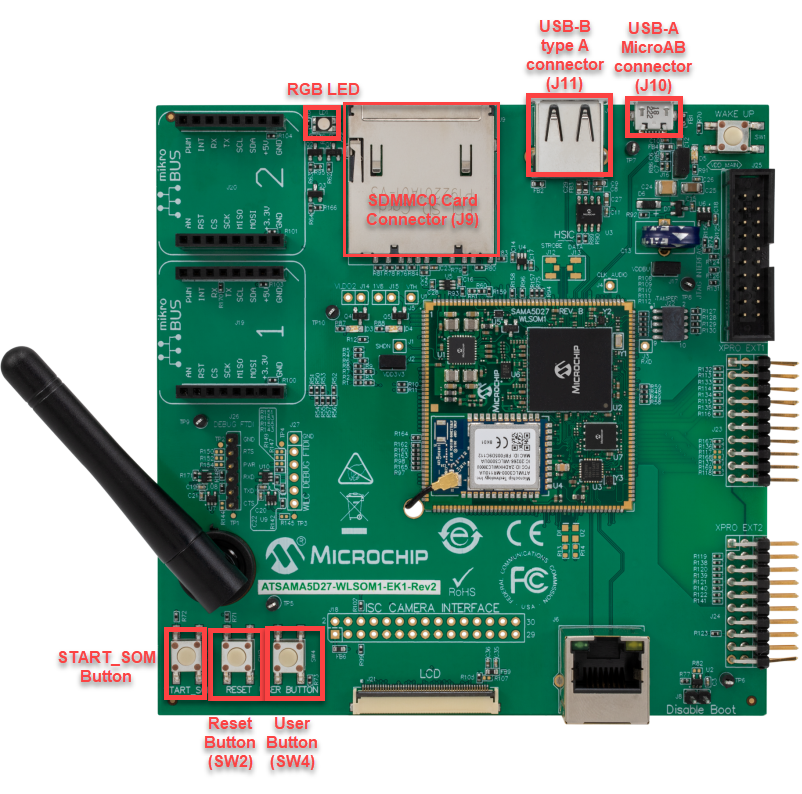
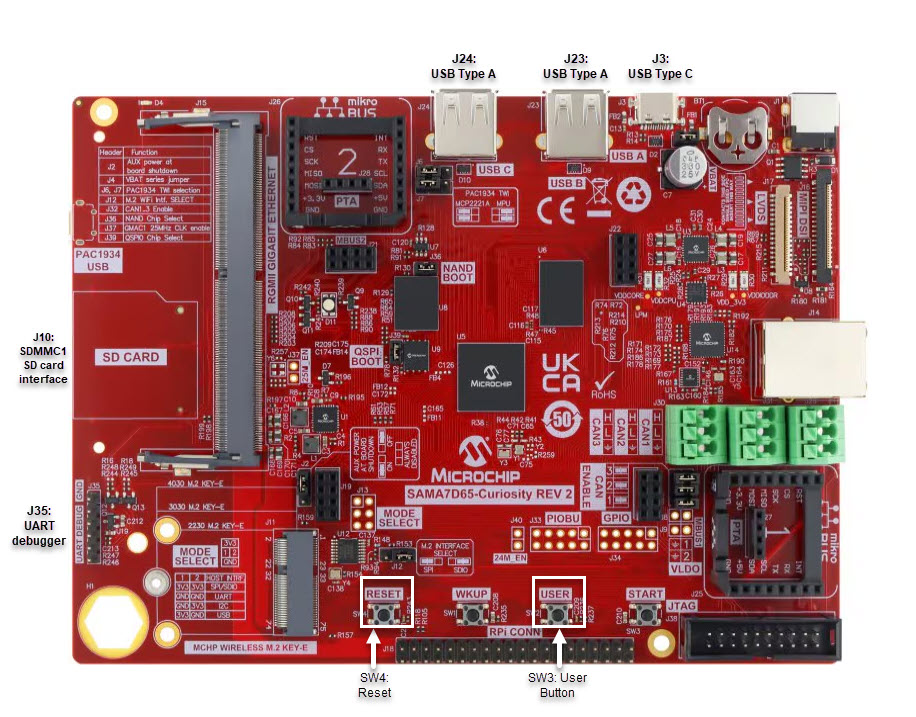

# HID Basic Example \(hid\_basic\)

This application demonstrates the ability of the MPLAB Harmony USB Device Stack to support  custom HID device class. This custom HID device can be controlled by a PC-based utility.

## **Description**

This application creates a USB HID Device that enumerates as a custom USB HID device on the  USB host PC. The device allows the USB Host utility to control the LEDs on the board and  query the status of a switch.

## **Downloading and building the application**

To clone or download this application from Github, go to the [main page of this repository](https://github.com/Microchip-MPLAB-Harmony/usb_apps_device) and then click **Clone** button to  clone this repository or download as zip file. This content can also be downloaded using  content manager by following these [instructions](https://github.com/Microchip-MPLAB-Harmony/contentmanager/wiki).

Path of the application within the repository is [usb\_apps\_device/apps/hid\_basic](https://github.com/Microchip-MPLAB-Harmony/usb_apps_device/tree/master/apps/hid_basic).

Following table gives the details of project configurations, target device used,  hardware and its IDE. Open the project using the respective IDE and build it.

 

|Project Name|IDE|Target Device|Hardware / Configuration|
|------------|---|-------------|------------------------|
|pic32cm\_le00\_curiosity\_pro.X|MPLABX|PIC32CM5164LE00100|PIC32CM Lx Curiosity Pro Board|
|pic32mz\_ef\_sk.X|MPLABX|PIC32MZ2048EFH144|PIC32MZ Embedded Connectivity with FPU \(EF\) Starter Kit|
|pic32mz\_ef\_sk\_freertos.X|MPLABX|PIC32MZ2048EFH144|PIC32MZ Embedded Connectivity with FPU \(EF\) Starter Kit|
|sam\_9x60\_ek.X|MPLABX|SAM9X60|SAM9X60-EK Evaluation Board|
|sam\_9x60\_ek\_freertos.X|MPLABX|SAM9X60|SAM9X60-EK Evaluation Board|
|sam\_9x60\_curiosity.X|MPLABX|SAM9X60|SAM9X60 Curiosity Development Board|
|sam\_9x60\_curiosity\_freertos.X|MPLABX|SAM9X60|SAM9X60 Curiosity Development Board|
|sam\_9x75\_eb.X|MPLABX|SAM9X75|SAM9X75-DDR3-EB Evaluation Board|
|sam\_a5d2\_xult.X|MPLABX|ATSAMA5D27C|SAMA5D2 Xplained Ultra Board|
|sam\_a5d2\_xult\_freertos.X|MPLABX|ATSAMA5D27C|SAMA5D2 Xplained Ultra Board|
|sam\_a5d27\_som1\_ek.X|MPLABX|ATSAMA5D27C|SAMA5D27 SOM1 Kit1|
|sam\_a5d27\_som1\_ek\_freertos.X|MPLABX|ATSAMA5D27C|SAMA5D27 SOM1 Kit1|
|sam\_a5d27\_wlsom1\_ek1.X|MPLABX|ATSAMA5D27C|ATSAMA5D27 WLSOM1 EK1|
|sam\_a5d27\_wlsom1\_ek1\_freertos.X|MPLABX|ATSAMA5D27C|ATSAMA5D27 WLSOM1 EK1|
|sam\_a7g5\_ek.X|MPLABX|SAMA7G54|SAMA7G5 EK Board|
|sam\_d11\_xpro.X|MPLABX|ATSAMD11D14A|SAMD11 Xplained Pro Board|
|sam\_d21\_xpro.X|MPLABX|ATSAMD21J18A|SAMD21 Xplained Pro Board|
|sam\_e54\_xpro.X|MPLABX|ATSAME54P20A|SAME54 Xplained Pro Board|
|sam\_e54\_xpro\_freertos.X|MPLABX|ATSAME54P20A|SAME54 Xplained Pro Board|
|sam\_e70\_xult.X|MPLABX|ATSAME70Q21B|SAME70 Xplained Ultra Board|
|sam\_e70\_xult\_freertos.X|MPLABX|ATSAME70Q21B|SAME70 Xplained Ultra Board|
|sam\_g55\_xpro.X|MPLABX|ATSAMG55J19|SAMG55 Xplained Pro Board|
|pic32mz\_ef\_curiosity\_2\_0.X|MPLABX|PIC32MZ2048EFM144|Curiosity PIC32MZ EF 2.0 Development Board|
|pic32mx470\_curiosity.X|MPLABX|PIC32MX470F512H|PIC32MX Curiosity Development Board|
|pic32mm\_usb\_curiosity.X|MPLABX|PIC32MM0256GPM064|PIC32MM USB Curiosity Development Board|
|pic32cz\_ca80\_curiosity\_ultra.X|MPLABX|PIC32CZ8110CA80208|PIC32CZ CA80 Curiosity Ultra development board|
|pic32cz\_ca80\_curiosity\_ultra\_freertos.X|MPLABX|PIC32CZ8110CA80208|PIC32CZ CA80 Curiosity Ultra development board|
|pic32ck\_gc01\_curiosity\_ultra.X|MPLABX|PIC32CK2051GC01144|PIC32CK GC Curiosity Ultra Development Board|
|pic32cx\_sg41\_curiosity\_ultra.X|MPLABX|PIC32CX1025SG41128|PIC32CX SG41 Curiosity Ultra Evaluation Board|
|sam\_a5d29\_curiosity.X|MPLABX|ATSAMA5D29|SAMA5D29 Curiosity Development Board|
|sam\_9x75\_curiosity.X|MPLABX|SAM9X75D2G|SAM9X75-Curiosity Development Board|
|sam\_a7d65\_curiosity.X|MPLABX|SAMA7D65|SAMA7D65 Curiosity Development Board|

 

## **Configuring the Hardware**

**[SAMD11 Xplained Pro Board](https://www.microchip.com/developmenttools/ProductDetails/atsamd11-xpro)**

-   Use TARGET USB connector on the board to connect the USB Device to the USB Host PC.
-   LED0 indicates USB Device Configuration Set Complete event \(the USB device functionality has been activated by the USB Host\). The LED is turned off when the Bus is suspended.
-   Press the switch SW0 to trigger communication from the USB Device to the USB Host.

**[SAMD21 Xplained Pro Board](https://www.microchip.com/developmenttools/ProductDetails/atsamd21-xpro)**

-   Use TARGET USB connector on the board to connect the USB Device to the USB Host PC.
-   LED0 indicates USB Device Configuration Set Complete event \(the USB device functionality has been activated by the USB Host\). The LED is turned off when the Bus is suspended.
-   Press the switch SW0 to trigger communication from the USB Device to the USB Host.

**[SAME54 Xplained Pro Board](https://www.microchip.com/developmenttools/productdetails/atsame54-xpro)**

-   Use TARGET USB connector on the board to connect the USB Device to the USB Host PC.
-   LED0 indicates USB Device Configuration Set Complete event \(the USB device functionality has been activated by the USB Host\). The LED is turned off when the Bus is suspended.
-   Press the switch SW0 to trigger communication from the USB Device to the USB Host.

**[SAME70 Xplained Ultra Board](https://www.microchip.com/DevelopmentTools/ProductDetails/PartNO/DM320113)**

-   Jumper J203 must be shorted between PB08 and VBUS \(positions 2 and 3\).
-   Use TARGET USB J200 connector on the board to connect the USB Device to the USB Host PC.
-   LED3 indicates USB Device Configuration Set Complete event \(the USB device functionality has been activated by the USB Host\). The LED is turned off when the Bus is suspended.
-   Press the switch SW400 to trigger communication from the USB Device to the USB Host.

**[SAMG55 Xplained Pro Board](https://www.microchip.com/DevelopmentTools/ProductDetails/PartNO/ATSAMG55-XPRO)**

-   Use TARGET USB connector on the board to connect the USB Device to the USB Host PC.
-   LED0 indicates USB Device Configuration Set Complete event \(the USB device functionality has been activated by the USB Host\). The LED is turned off when the Bus is suspended.
-   Press the switch SW0 to trigger communication from the USB Device to the USB Host.

**[Curiosity Pro PIC32CM LE00 Development Board](https://www.microchip.com/en-us/development-tool/EV80P12A)**

-   Use the USB micro-A/B "TARGET USB" connector \(D200\) to connect the USB Device to the USB Host PC.
-   LED0 indicates USB Device Configuration Set Complete event \(the USB device functionality has been activated by the USB Host\).
-   Press the switch SW0 to trigger communication from the USB Device to the USB Host.

**[PIC32CZ CA80 Curiosity Ultra development board](https://www.microchip.com/en-us/development-tool/ea61x20a)**

-   Use the USB micro-B "USB DEVICE" connector \(J102\) to connect the USB Device to the USB Host PC.
-   LED0 indicates USB Device Configuration Set Complete event \(The USB device functionality has been activated by the USB Host\).
-   Press the switch SW0 to trigger communication from the USB Device to the USB Host.

**[PIC32CK GC Curiosity Ultra Development Board](https://www.microchip.com/en-us/development-tool/ea23j82a)**

-   Use the Barrel jack connector\(J200\) to connect an external power supply to the board.
-   Use the USB Type-C "USB DEVICE" connector \(J202\) to connect the USB Device to the USB Host PC.
-   LED0 indicates USB Device Configuration Set Complete event \(The USB device functionality has been activated by the USB Host\).
-   Press the switch SW0 to trigger communication from the USB Device to the USB Host.

**__[PIC32CX SG41 Curiosity Ultra Evaluation Board](https://www.microchip.com/en-us/development-tool/EV06X38A)__**

-   Use the micro-B USB connector TARGET USB\( J200\) on the board to connect the USB Device to the USB Host PC.
-   LED1 indicates USB Device Configuration Set Complete event \(the USB device functionality has been activated by the USB Host\).
-   Press the switch SW1 to trigger communication from the USB Device to the USB Host.

**[Curiosity PIC32MZ EF 2.0 Development Board](https://www.microchip.com/Developmenttools/ProductDetails/DM320209)**

-   Use the USB micro-B port J201 to connect the USB Device to the USB Host PC.
-   LED1 indicates USB Device Configuration Set Complete event \(the USB device functionality has been activated by the USB Host\). The LED is turned off when the Bus is suspended.
-   Press the switch SW1 to trigger communication from the USB Device to the USB Host.

**[Curiosity PIC32MX470 Development Board](https://www.microchip.com/Developmenttools/ProductDetails/dm320103)**

-   Use the USB micro-B port J12 to connect the USB Device to the USB Host PC.
-   LED1 indicates USB Device Configuration Set Complete event \(the USB device functionality has been activated by the USB Host\).
-   Press the switch S1 to trigger communication from the USB Device to the USB Host.

**[PIC32MZ Embedded Connectivity with FPU \(EF\) Starter Kit](https://www.microchip.com/Developmenttools/ProductDetails/DM320007)**

-   Use the micro-A/B port J4 \(which is located on the bottom side of the board\) to connect the USB Device to the USB Host PC.
-   LED1 indicates USB Device Configuration Set Complete event \(the USB device functionality has been activated by the USB Host\). The LED is turned off when the Bus is suspended.
-   Press the switch SW1 to trigger communication from the USB Device to the USB Host.

**[PIC32MM USB Curiosity Development Board](https://www.microchip.com/en-us/development-tool/dm320107)**

-   Use the micro-B USB connector USB2 on the board to connect the USB Device to the USB Host PC.
-   LED1 indicates USB Device Configuration Set Complete event \(the USB device functionality has been activated by the USB Host\).
-   Press the switch S1 to trigger communication from the USB Device to the USB Host.

**[SAM9X60-EK Evaluation Board](https://www.microchip.com/developmenttools/ProductDetails/DT100126)**

-   Setup the SD card \(Note: exFAT formatted SD Cards are not supported\)

    -   Download harmony MPU bootstrap loader from this [location](https://github.com/Microchip-MPLAB-Harmony/usb_apps_device/tree/master/deps/at91bootstrap_sam_9x60_binaries/boot.bin).
    -   Copy the downloaded boot loader binary \(boot.bin\) and generated application binary \(harmony.bin\) into the SD card.
    -   Insert the SD card into the SDMMC connector J4 on the board.
    -   Reset the board by pressing the Push Button SW3.
-   Jumpers J20, J21, and J13 must be open.

-   Jumper J2 and J3 must be shorted.

-   Connect the USB Micro-B port J22 on board to the computer using a micro USB  cable \(to enable the debug com port\).

-   Connect the USB Micro-B Connector \(J7\) on the board to the computer using a  micro USB cable.

-   LED D1 indicates USB Device Configuration Set Complete event \(The USB  device functionality has been activated by the USB Host\). The LED is turned off when  the Bus is suspended.

-   Press the switch SW1 to trigger communication from the USB Device to the  USB Host.

    

    **[SAM9X75-DDR3-EB Evaluation Board](https://www.microchip.com/en-us/development-tool/EA14J50A)**

    -   Powered the board with an external power supply \(or use the micro AB  connector\).

    -   Setup the SD card \(Note: exFAT formatted SD Cards are not  supported\)

        -   Download harmony MPU bootstrap loader from this [location](https://github.com/Microchip-MPLAB-Harmony/usb_apps_device/tree/master/deps/at91bootstrap_sam_9x7_binaries/boot.bin).
        -   Copy the downloaded boot loader binary \(boot.bin\) and generated application binary \(harmony.bin\) into the SD card.
        -   Insert the SD card into the SDMMC connector \(SDMMC0\) on the board.
        -   Reset the board by pressing the Push Button RESET, then START.
    -   Connect USB to serial cable to DBGU0 \(to enable debug com port\).

    -   Connect the USB Micro-AB Connector on the board to the computer using  a micro USB cable.

    -   LED near VDDCORE inscription on the board indicates USB Device  Configuration Set Complete event \(The USB device functionality has been  activated by the USB Host\). The LED is turned off when the Bus is suspended.

    -   Press the switch USER to trigger communication from the USB Device to  the USB Host.

**[SAMA5D2 Xplained Ultra Board](https://www.microchip.com/Developmenttools/ProductDetails/ATSAMA5D2C-XULT)**

-   Setup the SD card \(Note: exFAT formatted SD Cards are not supported\)
    -   Download harmony MPU bootstrap loader from this [location](https://github.com/Microchip-MPLAB-Harmony/usb_apps_device/tree/master/deps/at91bootstrap_sam_a5d2_binaries/boot.bin).
    -   Copy the downloaded boot loader binary \(boot.bin\) and generated application binary \(harmony.bin\) into the SD card.
    -   Insert the SD card into the SDMMC1 slot on the board.
    -   Reset the board by pressing the Push Button BP3.
-   Short jumper JP2\(DEBUG\_DIS\).
-   Connect the EDBG USB Micro-B port J14 on the board to the computer using a micro USB cable.
-   Use the "A5-USB-A" connector \(J23 - Micro A/B connector\) on the board to connect the USB device to the USB Host.
-   RGB LED turning to Green indicates USB Device Configuration Set Complete event \(The USB device functionality has been activated by the USB Host\). The LED is turned off when the Bus is suspended.
-   Press PB\_USER Switch to trigger communication from the USB Device to the USB Host.

**[SAMA5D27 SOM1 Kit1](https://www.microchip.com/developmenttools/ProductDetails/atsama5d27-som1-ek1)**

-   Setup the SD card \(Note: exFAT formatted SD Cards are not supported\)
    -   Download harmony MPU bootstrap loader from this [location](https://github.com/Microchip-MPLAB-Harmony/usb_apps_device/tree/master/deps/at91bootstrap_sam_a5d27_som1_binaries/boot.bin).
    -   Copy the downloaded boot loader binary \(boot.bin\) and generated application binary \(harmony.bin\) into the SD card.
    -   Insert the SD card into the SDMMC0 slot \(J12\) on the board.
    -   Reset the board by pressing the Push Button PB1.
-   Connect the Debug USB port \(J10\) on the board to the computer using a micro USB cable.
-   Connect the USB Micro-B Connector \(J17\) on the board to the computer using a micro USB cable.
-   RGB LED turning to Green indicates USB Device Configuration Set Complete event \(The USB device functionality has been activated by the USB Host\). The LED is turned off when the Bus is suspended.
-   Press the pushbutton PB4 to trigger communication from the USB Device to the USB Host. 

**[ATSAMA5D27-WLSOM1 Evaluation Kit](https://www.microchip.com/DevelopmentTools/ProductDetails/PartNO/DM320117)**

-   Setup the SD card \(Note: exFAT formatted SD Cards are not supported\)
    -   Download harmony MPU bootstrap loader from this [location](https://github.com/Microchip-MPLAB-Harmony/usb_apps_device/tree/master/deps/at91bootstrap_sam_a5d27_wlsom1_binaries/boot.bin).
    -   Copy the downloaded boot loader binary \(boot.bin\) and generated application binary \(harmony.bin\) into the SD card.
    -   Insert the SD card into the SDMMC0 Card Connector \(J9\) on the board.
    -   Reset the board by pressing the Reset Button \(SW2\)
-   Connect the USB-A MicroAB connector \(J10\) on the board to the computer using a micro USB cable.
-   Press the "START\_SOM" button to activate board start-up.
-   RGB LED turning to Green indicates USB Device Configuration Set Complete event \(The USB device functionality has been activated by the USB Host\). The LED is turned off when the Bus is suspended.
-   Press the pushbutton SW4 to trigger communication from the USB Device to the USB Host.

**[SAMA7G5-EK Evaluation Kit](https://www.microchip.com/en-us/development-tool/EV21H18A)**

-   Powered the board with an external power supply \(J1\) or power supply the board by connecting J7 to the computer using a micro USB cable.
-   Setup the SD card \(Note: exFAT formatted SD Cards are not supported\)
    -   Download harmony MPU bootstrap loader from this [location](https://github.com/Microchip-MPLAB-Harmony/usb_apps_device/tree/master/deps/at91bootstrap_sam_a7g5_binaries/boot.bin).
    -   Copy the downloaded boot loader binary \(boot.bin\) and generated application binary \(harmony.bin\) into the SD card.
    -   Insert the SD card into the SD Card Connector \(J4\) on the board.
    -   Reset the board by pressing the Reset Button \(nRST\)
-   Press the "nSTART" button to activate board start-up.
-   Connect the USB MicroAB connector \(J7\) to the computer using an USB cable.
-   RGB LED turning to Green indicates USB Device Configuration Set Complete event \(The USB device functionality has been activated by the USB Host\). The LED is turned off when the Bus is suspended.
-   Press the USER BUTTON SW1 to trigger communication from the USB Device to the USB Host.

**[SAMA5D29 Curiosity Development Board](https://www.microchip.com/en-us/development-tool/ev07r15a)**

-   Setup the SD card \(Note: exFAT formatted SD Cards are not supported\)
    -   Download harmony MPU bootstrap loader from this [location](https://github.com/Microchip-MPLAB-Harmony/usb_apps_device/tree/master/deps/at91bootstrap_sam_a5d29_binaries/boot.bin).
    -   Copy the downloaded boot loader binary \(boot.bin\) and generated application binary \(harmony.bin\) into the SD card.
    -   Insert the SD card into the μSD-CARD connector \(J6\) on the board.\(This connector is present on the bottom face of the board\)
    -   Reset the board by pressing the Push Button RESET.
-   Press the "START" button to activate board start-up.
-   Connect the USB Type-C \(USB-A\) Connector \(J1\) on the board to the computer using a USB Type-C cable.
-   RGB LED \(D5\) turning to Green indicates USB Device Configuration Set Complete event \(The USB device functionality has been activated by the USB Host\). The LED is turned off when the Bus is suspended.
-   Press the "USER" Push Button \(SW1\) to trigger communication from the USB Device to the USB Host.

**SAM9X75-Curiosity Development Board**

-   Setup the SD card \(Note: exFAT formatted SD Cards are not supported\)
    -   Download harmony MPU bootstrap loader from this [location](https://github.com/Microchip-MPLAB-Harmony/usb_apps_device/tree/master/deps/at91bootstrap_sam_9x75_curiosity_binaries/boot.bin).
    -   Copy the downloaded boot loader binary \(boot.bin\) and generated application binary \(harmony.bin\) into the SD card.
    -   Insert the SD card into the μSD-CARD connector \(J14\) on the board.
    -   Reset the board by pressing the Push Button RESET.
-   Press the "START" button to activate board start-up.
-   Connect the USB Micro-B \(USB\_A\) Connector \(J2\) on the board to the computer using a USB cable.
-   RGB LED \(LD1\) turning to Green indicates USB Device Configuration Set Complete event \(The USB device functionality has been activated by the USB Host\).The LED is turned off when the Bus is suspended.
-   Press the "USER" Push Button \(SW2\) to trigger communication from the USB Device to the USB Host.

**[SAMA7D65 Curiosity Development Board](https://www.microchip.com/en-us/development-tool/ea89c15a#Overview)**

-   Setup the SD card \(Note: exFAT formatted SD Cards are not supported\)
    -   Download harmony MPU bootstrap loader from this [location](https://github.com/Microchip-MPLAB-Harmony/usb_apps_device/tree/master/deps/at91bootstrap_sam_a7d65_curiosity/boot.bin).
    -   Copy the downloaded boot loader binary \(boot.bin\) and generated application binary \(harmony.bin\) into the SD card.
    -   Insert the SD card into the SD-CARD connector \(J10\) on the board.
    -   Reset the board by pressing the Push Button RESET.

-   Press the "START" button to activate board start-up.
-   Connect the USB Type-C Connector \(J3\) on the board to the computer using a USB cable.
-   RGB LED turning to Green indicates USB Device Configuration Set Complete event \(The USB device functionality has been activated by the USB Host\).The LED is turned off when the Bus is suspended.
-   Press the "USER" Push Button \(SW3\) to trigger communication from the USB Device to the USB Host.

## **Running the Application**

This demonstration uses the selected hardware platform as a HID class USB device,  but uses the HID class for general purpose I/O operations. Open the project with appropriate  IDE. Compile the project and program the target device.

Typically, the HID class is used to implement human interface products, such as  mice and keyboards. The HID protocol, is however, quite flexible, and can be adapted and  used to send/receive general purpose data to/from a USB device. Using the HID class for  general purpose I/O operations is quite advantageous, in that it does not require any kind  of custom driver installation process. HID class drivers are already provided by and are  distributed with common operating systems. Therefore, upon plugging in a HID class device  into a typical computer system, no user installation of drivers is required, the  installation is fully automatic.

The LEDs on the demonstration board will indicate the USB state of the device as  described in Configuring the Hardware section.

HID devices primarily communicate through one interrupt IN endpoint and one  interrupt OUT endpoint. In most applications, this effectively limits the maximum achievable  bandwidth for full speed HID devices to 64 kBytes/s of IN traffic, and 64 kBytes/s of OUT  traffic \(64 kB/s, but effectively "full duplex"\).

The *GenericHIDSimpleDemo.exe* program, and the associated firmware  demonstrate how to use the HID protocol for basic general purpose USB data transfer.

Before you can run the *GenericHIDSimpleDemo.exe* executable, you will need  to have the Microsoft® .NET Framework Version 2.0 Redistributable Package \(later versions  are probably acceptable, but have not been tested\) installed on your computer. Programs that  were built in the Visual Studio® .NET languages require the .NET redistributable package.  The redistributable package can be freely downloaded from Microsoft’s website. Users of  Windows Vista® operating systems will not need to install the .NET framework, as it comes  preinstalled as part of the operating system.

## Launching the Application

To launch the application, open the executable *GenericHIDSimpleDemo.exe*  from the folder path  *__usb\_apps\_device/apps/hid\_basic/bin/GenericHIDSimpleDemo.exe__*. A UI similar to  the following should appear

:

Note: If instead of this window, an error message appears while trying to launch the application, it is likely the Microsoft .NET Framework Version 2.0 Redistributable Package has not yet been installed. Please install it and try again.

## **Send/Receive Packets**

To begin sending/receiving packets to the device, you must first find and connect  to the device. As configured by default, the application is looking for HID class USB  devices with VID = 0x04D8 and PID = 0x003F. The device descriptor in the firmware project  meant to be used with this demonstration uses the same VID/PID. If you plug in a USB device  programmed with the correct precompiled .hex file, and click **Connect**, the other push  buttons should become enabled. If clicking **Connect** has no effect, it is likely the  USB device is either not connected, or has not been programmed with the correct  firmware.

Clicking **Toggle LED\(s\)** should send a single packet of general purpose  generic data to the HID class USB peripheral device. The data will arrive on the interrupt  OUT endpoint. The firmware has been configured to receive this generic data packet, parse  the packet looking for the Toggle LED\(s\) command, and should respond appropriately by  controlling the LED\(s\) on the demonstration board.

The Get Pushbutton State option will send one packet of data over the USB to the  peripheral device \(to the interrupt OUT endpoint\) requesting the current push button state.  The firmware will process the received Get Pushbutton State command, and will prepare an  appropriate response packet depending upon the pushbutton state.

Refer to the Configuring the Hardware section for details on the LED indication  and Switch, that are relevant to the selected hardware.

**Parent topic:**[Harmony 3 USB Device application examples](GUID-90055758-897E-445A-8A8B-CE4EBF3930A7.md)

