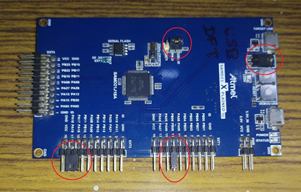
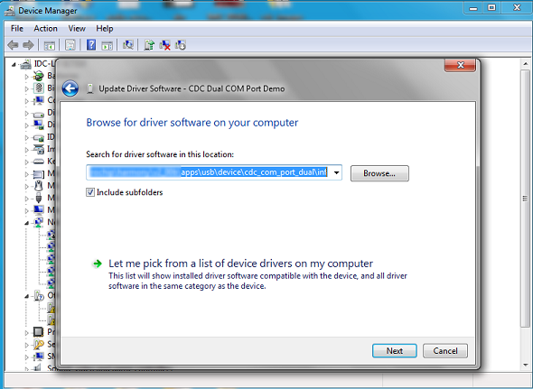

# USB UART Bridge Dual Channel Example \(usb\_usart\_bridge\_dual\)

This application demonstrates the ability of the MPLAB Harmony USB Device Stack to support  CDC Device Class using a real-world application. It implements a USB-USART Bridge  application.

## **Description**

This application demonstrates the use of the CDC device class to implement a dual USB-UART  bridge. The application enumerates two COM ports on the personal computer. Any data sent  through the virtual COM ports will be seen at the respective UART port Tx pin and data sent  through the UART Rx pin of the MCU will be seen at the virtual COM port.

## **Downloading and building the application**

To clone or download this application from Github, go to the [main page of this repository](https://github.com/Microchip-MPLAB-Harmony/usb_apps_device) and then click **Clone** button to  clone this repository or download as zip file. This content can also be downloaded using  content manager by following these [instructions](https://github.com/Microchip-MPLAB-Harmony/contentmanager/wiki).

Path of the application within the repository is [usb\_apps\_device/apps/usb\_usart\_bridge\_dual](https://github.com/Microchip-MPLAB-Harmony/usb_apps_device/tree/master/apps/usb_uart_bridge_dual).

Following table gives the details of project configurations, target device used,  hardware and its IDE. Open the project using the respective IDE and build it.

|Project Name|IDE|Target Device|Hardware / Configuration|
|------------|---|-------------|------------------------|
|sam\_d21\_xpro.X|MPLABX|ATSAMD21J18A|SAM D21 Xplained Pro board|

## **Configuring the Hardware**

**[SAM D21 Xplained Pro board](https://www.microchip.com/developmenttools/ProductDetails/atsamd21-xpro)**

-   Use TARGET USB connector on the board to connect the USB Device to the USB  Host PC.

-   LED0 indicates USB Device Configuration Set Complete event \(the USB device  functionality has been activated by the USB Host\).

-   The pins PA16 and PB08 have to be shorted with PA17 and PB09  respectively.

## **Running the Application**

This demonstration allows the device to appear like two serial \(COM\) ports to the  host. Do the following to run this demonstration:

1.  Open the project with appropriate IDE. Compile the project and program the  target device.

2.  Attach the device to the host. If the host is a personal computer and this is  the first time you have plugged this device into the computer, you may be prompted for a  .inf file:

3.  Select the "Install from a list or specific location \(Advanced\)" option. Specify the *..\\usb\_apps\_device\\apps\\cdc\_usart\_bridge\_dual\\inf* directory.Note: To specifically select the driver, open the device manager and expand the Ports \(COM & LPT\) tab, and right click on Update Driver Software.Verify that the enumerated USB device is seen as a virtual USB serial comport in Device Manager.
4.  Once the device is successfully installed, open two instances of terminal  program, such as HyperTerminal and select the appropriate COM port. Set the serial port  settings as follows:

    -   Baud : 9600
    -   Data : 8 Bits
    -   Parity : None
    -   Stop : 1 Bit
    -   Flow Control : None
    **Note:** The baud rate can different from 9600 but the chosen value has  to be the same on both the instances of terminal program.

    

5.  The LEDs on the demonstration board will indicate the USB state of the device. Refer to the Configuring the Hardware section for the selected board for more details.
6.  To run the demonstration, turn OFF the local echo on both the terminals. For Tera Term terminal application, navigate to Setup-\>Terminal to turn OFF local echo. A character or string typed in one terminal window will be displayed on the same terminal as the Rx/Tx pins are shorted.

**Parent topic:**[Harmony 3 USB Device application examples](GUID-90055758-897E-445A-8A8B-CE4EBF3930A7.md)

