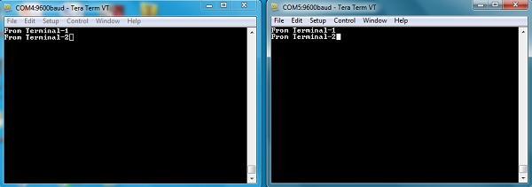

# CDC Serial Emulator Example \(cdc\_serial\_emulator\)

This application demonstrates the ability of the MPLAB Harmony USB Device Stack to support  CDC Device Class using a real-world application. It implements a CDC USART Serial Emulator  application.

## **Description**

This application demonstrates the use of the CDC device class to implement a USB-to-Serial  Converter. TThe application enumerates a COM port on the personal computer. Data received  through the CDC USB interface is forwarded to a UART. Data received on the UART is forwarded  to the CDC USB interface on the target board. The interface between the UART and the CDC USB  Interface on the board demonstrates the USB to UART capability.

## **Downloading and building the application**

To clone or download this application from Github, go to the [main page of this repository](https://github.com/Microchip-MPLAB-Harmony/usb_apps_device) and then click **Clone** button to  clone this repository or download as zip file. This content can also be downloaded using  content manager by following these [instructions](https://github.com/Microchip-MPLAB-Harmony/contentmanager/wiki).

Path of the application within the repository is  **apps\\cdc\_serial\_emulator**.

Following table gives the details of project configurations, target device used,  hardware and its IDE. Open the project using the respective IDE and build it.

|Project Name|IDE|Target Device|Hardware / Configuration|
|------------|---|-------------|------------------------|
|sam\_9x75\_eb.X|MPLABX|SAM9X75|SAM9X75-DDR3-EB Evaluation Board|
|sam\_d11\_xpro.X|MPLABX|ATSAMD11D14A|SAMD11 Xplained Pro board|
|sam\_d21\_xpro.X|MPLABX|ATSAMD21J18A|SAMD21 Xplained Pro board|
|sam\_e54\_xpro.X|MPLABX|ATSAME54P20A|SAME54 Xplained Pro board|
|sam\_e70\_xult.X|MPLABX|ATSAME70Q21B|SAME70 Xplained Ultra board|
|sam\_e70\_xult\_freertos.X|MPLABX|ATSAME70Q21B|SAME70 Xplained Ultra board|
|pic32mz\_ef\_curiosity\_2\_0.X|MPLABX|PIC32MZ2048EFM144|Curiosity PIC32MZ EF 2.0 Development Board|
|pic32cz\_ca80\_curiosity\_ultra.X|MPLABX|PIC32CZ8110CA80208|  PIC32CZ CA80 Curiosity Ultra development board |

## **Configuring the Hardware**

**[SAM D11 Xplained Pro board](https://www.microchip.com/developmenttools/ProductDetails/atsamd11-xpro)**

-   Use TARGET USB connector on the board to connect the USB Device to the USB Host PC.
-   LED0 indicates USB Device Configuration Set Complete event \(the USB device functionality has been activated by the USB Host\).
-   The CDC USB \(UART to USB\) interface on this board is served by the EDBG connector \(DEBUG\_USB\). Connecting this to the PC will create a COM port on the PC Host.

**[SAMD21 Xplained Pro board](https://www.microchip.com/developmenttools/ProductDetails/atsamd21-xpro)**

-   Use TARGET USB connector on the board to connect the USB Device to the USB Host PC.
-   LED0 indicates USB Device Configuration Set Complete event \(the USB device functionality has been activated by the USB Host\).
-   The CDC USB \(UART to USB\) interface on this board is served by the EDBG connector \(DEBUG\_USB\). Connecting this to the PC will create a COM port on the PC Host.

**[SAME54 Xplained Pro board](https://www.microchip.com/developmenttools/productdetails/atsame54-xpro)**

-   Use TARGET USB connector on the board to connect the USB Device to the USB Host PC.
-   LED0 indicates USB Device Configuration Set Complete event \(the USB device functionality has been activated by the USB Host\).
-   The CDC USB \(UART to USB\) interface on this board is served by the EDBG connector \(DEBUG\_USB\). Connecting this to the PC will create a COM port on the PC Host.

**[SAME70 Xplained Ultra board](https://www.microchip.com/DevelopmentTools/ProductDetails/PartNO/DM320113)**

-   Jumper J203 must be shorted between PB08 and VBUS \(positions 2 and 3\).
-   Use TARGET USB connector on the board to connect the USB Device to the USB Host PC.
-   LED3 indicates USB Device Configuration Set Complete event \(the USB device functionality has been activated by the USB Host\).
-   The CDC USB \(UART to USB\) interface on this board is served by the EDBG connector J300. Connecting this to the PC will create a COM port on the PC Host.

**[Curiosity PIC32MZ EF 2.0 Development Board](https://www.microchip.com/Developmenttools/ProductDetails/DM320209)**

-   Use the USB micro-B port J201 to connect the USB Device to the USB Host PC.
-   LED1 indicates USB Device Configuration Set Complete event \(the USB device functionality has been activated by the USB Host\).
-   The CDC USB \(UART to USB\) interface on this board is served by the DEBUG\_USB connector J700. Connecting this to the PC will create a COM port on the PC Host.

**[PIC32CZ CA80 Curiosity Ultra development board](https://www.microchip.com/en-us/development-tool/ea61x20a)**

-   Use the USB micro-B "USB DEVICE" connector \(J102\) to connect the USB Device to the USB Host PC.
-   LED0 indicates USB Device Configuration Set Complete event \(the USB device functionality has been activated by the USB Host\).
-   The CDC USB \(UART to USB\) interface on this board is served by the DEBUG\_USB connector. Connecting this to the PC will create a COM port on the PC Host.

**[SAM9X75-DDR3-EB Evaluation Board](https://www.microchip.com/en-us/development-tool/EA14J50A)**

-   Powered the board with an external power supply \(or use the micro AB  connector\).

-   Setup the SD card \(Note: exFAT formatted SD Cards are not supported\)

    -   Download harmony MPU bootstrap loader from this [location](https://github.com/Microchip-MPLAB-Harmony/usb_apps_device/tree/master/deps/at91bootstrap_sam_9x7_binaries/boot.bin).
    -   Copy the downloaded boot loader binary \(boot.bin\) and generated application binary \(harmony.bin\) into the SD card.
    -   Insert the SD card into the SDMMC connector \(SDMMC0\) on the board.
    -   Reset the board by pressing the Push Button RESET, then START.
-   Connect USB to serial cable to DBGU0 \(to enable debug com port\).

-   Connect the USB Micro-AB Connector on the board to the computer using a  micro USB cable.

-   LED near VDDCORE inscription on the board indicates USB Device  Configuration Set Complete event \(The USB device functionality has been activated by  the USB Host\).

-   The demonstration uses an USB to serial cable to transfer demonstration  application messages on a PC.

    

## **Running the Application**

This application demonstrates the use of the CDC Device class in implementing a  USB-to-Serial Converter. The application enumerates a COM port on the USB Host PC. Data  received through the CDC USB interface is forwarded to a UART. Data received on the UART is  forwarded to the CDC USB interface. This emulates a USB-to-Serial Converter.

1.  Open the project with appropriate IDE. Compile the project and program the  target device.

2.  Attach the device to the host. If the host is a personal computer and this is  the first time you have plugged this device into the computer you may be prompted for a  .inf file.

    

3.  Select the "Install from a list or specific location \(Advanced\)" option. Navigate to the driver path available in the repo - *..\\usb\_apps\_device\\apps\\cdc\_serial\_emulator\\inf*.NOTE: The LEDs on the demonstration board will indicate the USB state of the device. Refer to the Configuring the Hardware section for the selected target hardware.
4.  Once the device is successfully installed and visible on the *Device Manager*, open up a terminal program, such as HyperTerminal and select the appropriate COM port. This is terminal 1. Set the serial port settings as follows:
    -   Baud : 9600
    -   Data : 8 Bits
    -   Parity : None
    -   Stop : 1 Bit
    -   Flow Control : None
5.  Connect the CDC USB port to the Host PC and ensure that a second COM port is available on the Host PC. Refer to the Configuring the Hardware section for more details. Open a serial terminal program and select the second COM port. The serial settings of this COM port should match the setting made in *previous step*. This is terminal 2. The setup should resemble the below figure.
6.  To run the demonstration, turn on local echo on both the terminals. If the terminal application is Tera Term, navigate to Setup-\>Terminal to turn on local echo. Type a character or string in one terminal window. The same character or string shall appear on the second terminal window and vice versa. The following screen shot shows two instances of Tera Term.Note: Some terminal programs, like HyperTerminal, require users to click the disconnect button before removing the device from the computer. Failing to do so may result in having to close and open the program again to reconnect to the device.

**Parent topic:**[Harmony 3 USB Device application examples](GUID-90055758-897E-445A-8A8B-CE4EBF3930A7.md)

