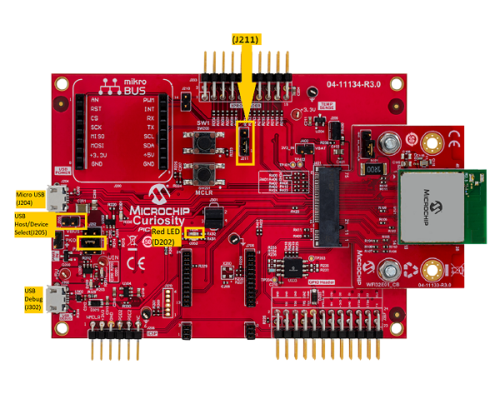

# CDC COM Port Single Example \(cdc\_com\_port\_single\)

This application demonstrates the ability of the MPLAB Harmony USB Device Stack to  support USB Communication Device Class. It demonstrates two-way communication between  the USB device and the USB Host PC.

## **Description**

This application creates a USB CDC Device that enumerates as a single COM port on the  USB host PC. The COM port can be opened using any of the terminal applications. To  demonstrate two-way communication, when a character is typed on the terminal window,  it is echoed back by the USB device.

## Downloading and building the application

To clone or download this application from Github, go to the [main page of this repository](https://github.com/Microchip-MPLAB-Harmony/usb_apps_device) and then click **Clone**  button to clone this repository or download as zip file. This content can also be  downloaded using content manager by following these [instructions](https://github.com/Microchip-MPLAB-Harmony/contentmanager/wiki).

Path of the application within the repository is [usb\_apps\_device/apps/cdc\_com\_port\_single](https://github.com/Microchip-MPLAB-Harmony/usb_apps_device/tree/master/apps/cdc_com_port_single).

Following table gives the details of project configurations, target device used,  hardware and its IDE. Open the project using the respective IDE and build it.

 

|Project Name|IDE|Target Device|Hardware / Configuration|
|------------|---|-------------|------------------------|
|pic32cm\_le00\_curiosity\_pro.X|MPLABX|PIC32CM5164LE00100|PIC32CM LE00 Curiosity Pro Evaluation Kit|
|pic32mm\_usb\_curiosity.X|MPLABX|PIC32MM0256GPM064|PIC32MM USB Curiosity Development Board|
|pic32mk\_gp\_db.X|MPLABX|PIC32MK1024GPE100|PIC32MK General Purpose \(GP\) Development Board|
|pic32mk\_gp\_db\_freertos.X|MPLABX|PIC32MK1024GPE100|PIC32MK General Purpose \(GP\) Development Board|
|pic32mx470\_curiosity.X|MPLABX|PIC32MX470F512H|PIC32MX Curiosity Development Board|
|pic32mx470\_curiosity\_freertos.X|MPLABX|PIC32MX470F512H|PIC32MX Curiosity Development Board|
|pic32mz\_das\_sk.X|MPLABX|PIC32MZ2064DAS169|PIC32MZ Embedded Graphics with Stacked DRAM \(DA\) Starter  Kit|
|pic32mz\_ef\_curiosity\_2.X|MPLABX|PIC32MZ2048EFM144|Curiosity PIC32MZ EF 2.0 Development Board|
|pic32mz\_ef\_sk.X|MPLABX|PIC32MZ2048EFH144|PIC32MZ Embedded Connectivity with FPU \(EF\) Starter  Kit|
|pic32mz\_ef\_sk\_freertos.X|MPLABX|PIC32MZ2048EFH144|PIC32MZ Embedded Connectivity with FPU \(EF\) Starter  Kit|
|pic32mz\_w1\_curiosity.X|MPLABX|PIC32MZ1025W104132|Curiosity PIC32MZ W1 Development Board|
|sam\_9x60\_ek.X|MPLABX|SAM9X60|SAM9X60-EK Evaluation Board|
|sam\_9x60\_ek\_freertos.X|MPLABX|SAM9X60|SAM9X60-EK Evaluation Board|
|sam\_9x60\_curiosity.X|MPLABX|SAM9X60|SAM9X60 Curiosity Development Board|
|sam\_9x60\_curiosity\_freertos.X|MPLABX|SAM9X60|SAM9X60 Curiosity Development Board|
|sam\_9x75\_eb.X|MPLABX|SAM9X75|SAM9X75-DDR3-EB Evaluation Board|
|sam\_a5d2\_xult.X|MPLABX|ATSAMA5D27C|SAMA5D2 Xplained Ultra Board|
|sam\_a5d2\_xult\_freertos.X|MPLABX|ATSAMA5D27C|SAMA5D2 Xplained Ultra Board|
|sam\_a5d27\_som1\_ek.X|MPLABX|ATSAMA5D27C|SAMA5D27 SOM1 Kit1|
|sam\_a5d27\_som1\_ek\_freertos.X|MPLABX|ATSAMA5D27C|SAMA5D27 SOM1 Kit1|
|sam\_a5d27\_wlsom1\_ek1.X|MPLABX|ATSAMA5D27C|ATSAMA5D27 WLSOM1 EK1|
|sam\_a5d27\_wlsom1\_ek1\_freertos.X|MPLABX|ATSAMA5D27C|ATSAMA5D27 WLSOM1 EK1|
|sam\_a7g5\_ek.X|MPLABX|SAMA7G54|SAMA7G5 EK Board|
|sam\_d11\_xpro.X|MPLABX|ATSAMD11D14A|SAMD11 Xplained Pro Board|
|sam\_d21\_xpro.X|MPLABX|ATSAMD21J18A|SAMD21 Xplained Pro Board|
|sam\_da1\_xpro.X|MPLABX|ATSAMDA1J16B|SAMDA1 Xplained Pro Board|
|sam\_e54\_xpro.X|MPLABX|ATSAME54P20A|SAME54 Xplained Pro Board|
|sam\_e54\_xpro\_freertos.X|MPLABX|ATSAME54P20A|SAME54 Xplained Pro Board|
|sam\_e70\_xult.X|MPLABX|ATSAME70Q21B|SAME70 Xplained Ultra Board|
|sam\_e70\_xult\_freertos.X|MPLABX|ATSAME70Q21B|SAME70 Xplained Ultra Board|
|sam\_g55\_xpro.X|MPLABX|ATSAMG55J19|SAMG55 Xplained Pro Board|
|sam\_l21\_xpro.X|MPLABX|ATSAML21J18B|SAML21 Xplained Pro Board|
|sam\_l22\_xpro.X|MPLABX|ATSAML22N18A|SAML22 Xplained Pro Board|
|pic32cz\_ca80\_curiosity\_ultra.X|MPLABX|PIC32CZ8110CA80208|PIC32CZ CA80 Curiosity Ultra development board|
|pic32cz\_ca80\_curiosity\_ultra\_freertos.X|MPLABX|PIC32CZ8110CA80208|PIC32CZ CA80 Curiosity Ultra development board|
|pic32ck\_gc01\_curiosity\_ultra.X|MPLABX|PIC32CK2051GC01144|PIC32CK GC Curiosity Ultra Development Board|
|pic32ck\_gc01\_curiosity\_ultra\_freertos.X|MPLABX|PIC32CK2051GC01144|PIC32CK GC Curiosity Ultra Development Board|
|pic32cx\_sg41\_curiosity\_ultra.X|MPLABX|PIC32CX1025SG41128|PIC32CX SG41 Curiosity Ultra Evaluation Board|

 

## **Configuring the Hardware**

**[__PIC32CX SG41 Curiosity Ultra Evaluation Board__](https://www.microchip.com/en-us/development-tool/EV06X38A)**

-   Use the micro-B USB connector Target USB\( J200\) on the board to connect the  USB Device to the USB Host PC.

-   LED1 indicates USB Device Configuration Set Complete event \(the USB device functionality has been activated by the USB Host\).
-   Press the switch SW1 to trigger communication from the USB Device to the USB Host.

**[PIC32CZ CA80 Curiosity Ultra development board](HTTPS://WWW.MICROCHIP.COM/EN-US/DEVELOPMENT-TOOL/EA61X20A)**

-   Use the Barrel jack connector\(J200\) to connect an external power supply to the board.
-   Use the USB micro-B connector \(J102\) to connect the USB Device to the USB Host PC.
-   LED0 indicates USB Device Configuration Set Complete event \(The USB device functionality has been activated by the USB Host\).
-   Press the switch SW0 to trigger communication from the USB Device to the USB Host.

**[PIC32CK GC Curiosity Ultra Development Board](https://www.microchip.com/en-us/development-tool/ea23j82a)**

-   Use the Barrel jack connector\(J200\) to connect an external power supply to the board.
-   Use the USB Type-C connector \(J202\) to connect the USB Device to the USB Host PC.
-   LED0 indicates USB Device Configuration Set Complete event \(The USB device functionality has been activated by the USB Host\).
-   Press the switch SW0 to trigger communication from the USB Device to the USB Host.

**[SAMD11 Xplained Pro Board](https://www.microchip.com/developmenttools/ProductDetails/atsamd11-xpro)**

-   Use TARGET USB connector on the board to connect the USB Device to the USB Host PC.
-   LED0 indicates USB Device Configuration Set Complete event \(the USB device functionality has been activated by the USB Host\).
-   Press the switch SW0 to trigger communication from the USB Device to the USB Host.

**[SAMD21 Xplained Pro Board](https://www.microchip.com/developmenttools/ProductDetails/atsamd21-xpro)**

-   Use TARGET USB connector on the board to connect the USB Device to the USB Host PC.
-   LED0 indicates USB Device Configuration Set Complete event \(the USB device functionality has been activated by the USB Host\).
-   Press the switch SW0 to trigger communication from the USB Device to the USB Host.

**[SAME54 Xplained Pro Board](https://www.microchip.com/developmenttools/productdetails/atsame54-xpro)**

-   Use TARGET USB connector on the board to connect the USB Device to the USB Host PC.
-   LED0 indicates USB Device Configuration Set Complete event \(the USB device functionality has been activated by the USB Host\).
-   Press the switch SW0 to trigger communication from the USB Device to the USB Host.

**[SAME70 Xplained Ultra Board](https://www.microchip.com/DevelopmentTools/ProductDetails/PartNO/DM320113)**

-   Jumper J203 must be shorted between PB08 and VBUS \(positions 2 and 3\).
-   Use TARGET USB J200 connector on the board to connect the USB Device to the USB Host PC.
-   LED3 indicates USB Device Configuration Set Complete event \(the USB device functionality has been activated by the USB Host\).
-   Press the switch SW400 to trigger communication from the USB Device to the USB Host.

**[SAMG55 Xplained Pro Board](https://www.microchip.com/DevelopmentTools/ProductDetails/PartNO/ATSAMG55-XPRO)**

-   Use TARGET USB connector on the board to connect the USB Device to the USB Host PC.
-   LED0 indicates USB Device Configuration Set Complete event \(the USB device functionality has been activated by the USB Host\).
-   Press the switch SW0 to trigger communication from the USB Device to the USB Host.

**[SAML21 Xplained Pro Board](https://www.microchip.com/developmenttools/ProductDetails/PartNO/ATSAML21-XPRO-B)**

-   Use TARGET USB connector on the board to connect the USB Device to the USB Host PC.
-   LED0 indicates USB Device Configuration Set Complete event \(the USB device functionality has been activated by the USB Host\).
-   Press the switch SW0 to trigger communication from the USB Device to the USB Host.

**[SAML22 Xplained Pro Board](https://www.microchip.com/developmenttools/ProductDetails/PartNO/ATSAML22-XPRO-B)**

-   Use TARGET USB connector on the board to connect the USB Device to the USB Host PC.
-   LED0 indicates USB Device Configuration Set Complete event \(the USB device functionality has been activated by the USB Host\).
-   Press the switch SW0 to trigger communication from the USB Device to the USB Host.

**[SAMDA1 Xplained Pro Board](https://www.microchip.com/developmenttools/ProductDetails/PartNO/ATSAMDA1-XPRO)**

-   Use TARGET USB connector on the board to connect the USB Device to the USB Host PC.
-   LED0 indicates USB Device Configuration Set Complete event \(the USB device functionality has been activated by the USB Host\).
-   Press the switch SW0 to trigger communication from the USB Device to the USB Host.

**[PIC32CM LE00 Curiosity Pro Evaluation Kit](HTTPS://WWW.MICROCHIP.COM/EN-US/DEVELOPMENT-TOOL/EV80P12A)**

-   Use the USB micro-A/B "TARGET USB" connector \(D200\) to connect the USB Device to the USB Host PC.
-   LED0 indicates USB Device Configuration Set Complete event \(the USB device functionality has been activated by the USB Host\).
-   Press the switch SW0 to trigger communication from the USB Device to the USB Host.

**[PIC32MK General Purpose \(GP\) Development Board](https://www.microchip.com/developmenttools/ProductDetails/dm320106)**

-   Jumper J28 must be removed.
-   Use the USB micro-B port J13 \(which is located on the bottom side of the board\) to connect the USB Device to the USB Host PC.
-   LED1 indicates USB Device Configuration Set Complete event \(the USB device functionality has been activated by the USB Host\).
-   Press the switch S1 to trigger communication from the USB Device to the USB Host.

**[Curiosity PIC32MX470 Development Board](https://www.microchip.com/Developmenttools/ProductDetails/dm320103)**

-   Use the USB micro-B port J12 to connect the USB Device to the USB Host PC.
-   LED1 indicates USB Device Configuration Set Complete event \(the USB device functionality has been activated by the USB Host\).
-   Press the switch S1 to trigger communication from the USB Device to the USB Host.

**[PIC32MZ Embedded Graphics with Stacked DRAM \(DA\) Starter Kit](https://www.microchip.com/DevelopmentTools/ProductDetails/DM320010-C)**

-   Use the micro-A/B port J6 \(which is located on the bottom side of the board\) to connect the USB Device to the USB Host PC.
-   LED1 indicates USB Device Configuration Set Complete event \(the USB device functionality has been activated by the USB Host\).
-   Press the switch SW1 to trigger communication from the USB Device to the USB Host.

**[Curiosity PIC32MZ EF 2.0 Development Board](https://www.microchip.com/Developmenttools/ProductDetails/DM320209)**

-   Use the USB micro-B port J201 to connect the USB Device to the USB Host PC.
-   LED1 indicates USB Device Configuration Set Complete event \(the USB device functionality has been activated by the USB Host\).
-   Press the switch SW1 to trigger communication from the USB Device to the USB Host.

**[PIC32MZ Embedded Connectivity with FPU \(EF\) Starter Kit](https://www.microchip.com/Developmenttools/ProductDetails/DM320007)**

-   Use the micro-A/B port J4 \(which is located on the bottom side of the board\) to connect the USB Device to the USB Host PC.
-   LED1 indicates USB Device Configuration Set Complete event \(the USB device functionality has been activated by the USB Host\).
-   Press the switch SW1 to trigger communication from the USB Device to the USB Host.

**[Curiosity PIC32MZ W1 Development Board](https://www.microchip.com/DevelopmentTools/ProductDetails/PartNO/DM320104)**

-   Use the USB micro-B port J204 to connect the USB Device to the  USB Host PC.

-   J205 must be open for the Device Functionality

-   Jumper on the pin J211 must be placed between pin 1 and pin  2

-   The LED D202 indicates USB Device Configuration Set Complete  event \(the USB device functionality has been activated by the USB  Host\).

-   Press the switch SW200 to trigger communication from the USB  Device to the USB Host.

**[PIC32MM USB Curiosity Development Board](https://www.microchip.com/en-us/development-tool/dm320107)**

-   Use the micro-B USB connector USB2 on the board to connect the USB Device to the USB Host PC.
-   LED1 indicates USB Device Configuration Set Complete event \(the USB device functionality has been activated by the USB Host\).
-   Press the switch S1 to trigger communication from the USB Device to the USB Host.

**[SAM9X60-EK Evaluation Board](https://www.microchip.com/developmenttools/ProductDetails/DT100126)**

-   Setup the SD card \(Note: exFAT formatted SD Cards are not  supported\)

    -   Download harmony MPU bootstrap loader from this [location](https://github.com/Microchip-MPLAB-Harmony/usb_apps_device/tree/master/deps/at91bootstrap_sam_9x60_binaries/boot.bin).
    -   Copy the downloaded boot loader binary \(boot.bin\) and generated application binary \(harmony.bin\) into the SD card.
    -   Insert the SD card into the SDMMC connector J4 on the board.
    -   Reset the board by pressing the Push Button SW3.
-   Jumpers J20, J21, and J13 must be open.

-   Jumper J2 and J3 must be shorted.

-   Connect the USB Micro-B port J22 on board to the computer using  a micro USB cable \(to enable the debug com port\).

-   Connect the USB Micro-B Connector \(J7\) on the board to the  computer using a micro USB cable.

-   LED D1 indicates USB Device Configuration Set Complete event  \(The USB device functionality has been activated by the USB Host\).

-   Press the switch SW1 to trigger communication from the USB  Device to the USB Host.

**Note: Reset push button on SAM9X60 EK is labeled as SW3**

**[SAM9X60-Curiosity Board](https://www.microchip.com/en-us/development-tool/EV40E67A)**

-   Setup the SD card \(Note: exFAT formatted SD Cards are not supported\)
    -   Download harmony MPU bootstrap loader from this [location](https://github.com/Microchip-MPLAB-Harmony/usb_apps_device/tree/master/deps/at91bootstrap_sam_9x60_binaries/boot.bin).
    -   Copy the downloaded boot loader binary \(boot.bin\) and generated application binary \(harmony.bin\) into the SD card.
    -   Insert the SD card into the SDMMC0 connector J3 on the board.
    -   Reset the board by pressing the Push Button RESET.
-   Jumper J4 must be shorted.
-   Connect the USB Micro-B Connector \(J1\) on the board to the computer using a micro USB cable.
-   LED D1 indicates USB Device Configuration Set Complete event \(The USB device functionality has been activated by the USB Host\).
-   Press the switch "USER" to trigger communication from the USB Device to the USB Host.

**[SAM9X75-DDR3-EB Evaluation Board](https://www.microchip.com/en-us/development-tool/EA14J50A)**

-   Powered the board with an external power supply \(or use the  micro AB connector\).

-   Setup the SD card \(Note: exFAT formatted SD Cards are not  supported\)

    -   Download harmony MPU bootstrap loader from this [location](https://github.com/Microchip-MPLAB-Harmony/usb_apps_device/tree/master/deps/at91bootstrap_sam_9x7_binaries/boot.bin).
    -   Copy the downloaded boot loader binary \(boot.bin\) and generated application binary \(harmony.bin\) into the SD card.
    -   Insert the SD card into the SDMMC connector \(SDMMC0\) on the board.
    -   Reset the board by pressing the Push Button RESET, then START.
-   Connect USB to serial cable to DBGU0 \(to enable debug com  port\).

-   Connect the USB Micro-AB Connector on the board to the computer  using a micro USB cable.

-   LED near VDDCORE inscription on the board indicates USB Device  Configuration Set Complete event \(The USB device functionality has been  activated by the USB Host\).

-   Press the switch USER to trigger communication from the USB  Device to the USB Host.

**[SAMA5D2 Xplained Ultra Board](https://www.microchip.com/Developmenttools/ProductDetails/ATSAMA5D2C-XULT)**

-   Setup the SD card \(Note: exFAT formatted SD Cards are not supported\)
    -   Download harmony MPU bootstrap loader from this [location](https://github.com/Microchip-MPLAB-Harmony/usb_apps_device/tree/master/deps/at91bootstrap_sam_a5d2_binaries/boot.bin).
    -   Copy the downloaded boot loader binary \(boot.bin\) and generated application binary \(harmony.bin\) into the SD card.
    -   Insert the SD card into the SDMMC1 slot on the board.
    -   Reset the board by pressing the Push Button BP3.
-   Short jumper JP2\(DEBUG\_DIS\).
-   Connect the EDBG USB Micro-B port J14 on the board to the computer using a micro USB cable.
-   Use the "A5-USB-A" connector \(J23 - Micro A/B connector\) on the board to connect the USB device to the USB Host.
-   RGB LED turning to Green indicates USB Device Configuration Set Complete event \(The USB device functionality has been activated by the USB Host\).
-   Press PB\_USER Switch to trigger communication from the USB Device to the USB Host.

**[SAMA5D27 SOM1 Kit1](https://www.microchip.com/developmenttools/ProductDetails/atsama5d27-som1-ek1)**

-   Setup the SD card \(Note: exFAT formatted SD Cards are not supported\)
    -   Download harmony MPU bootstrap loader from this [location](https://github.com/Microchip-MPLAB-Harmony/usb_apps_device/tree/master/deps/at91bootstrap_sam_a5d27_som1_binaries/boot.bin).
    -   Copy the downloaded boot loader binary \(boot.bin\) and generated application binary \(harmony.bin\) into the SD card.
    -   Insert the SD card into the SDMMC0 slot \(J12\) on the board.
    -   Reset the board by pressing the Push Button PB1.
-   Connect the Debug USB port \(J10\) on the board to the computer using a micro USB cable.
-   Connect the USB Micro-B Connector \(J17\) on the board to the computer using a micro USB cable.
-   RGB LED turning to Green indicates USB Device Configuration Set Complete event \(The USB device functionality has been activated by the USB Host\).
-   Press the pushbutton PB4 to trigger communication from the USB Device to the USB Host.

**[ATSAMA5D27-WLSOM1 Evaluation Kit](https://www.microchip.com/DevelopmentTools/ProductDetails/PartNO/DM320117)**

-   Setup the SD card \(Note: exFAT formatted SD Cards are not supported\)
    -   Download harmony MPU bootstrap loader from this [location](https://github.com/Microchip-MPLAB-Harmony/usb_apps_device/tree/master/deps/at91bootstrap_sam_a7g5_binaries/boot.bin).
    -   Copy the downloaded boot loader binary \(boot.bin\) and generated application binary \(harmony.bin\) into the SD card.
    -   Insert the SD card into the SDMMC0 Card Connector \(J9\) on the board.
    -   Reset the board by pressing the Reset Button \(SW2\)
-   Connect the USB-A MicroAB connector \(J10\) on the board to the computer using a micro USB cable.
-   Press the "START\_SOM" button to activate board start-up.
-   RGB LED turning to Green indicates USB Device Configuration Set Complete event \(The USB device functionality has been activated by the USB Host\).
-   Press the pushbutton SW4 to trigger communication from the USB Device to the USB Host.

**[SAMA7G5-EK Evaluation Kit](https://www.microchip.com/en-us/development-tool/EV21H18A)**

-   Powered the board with an external power supply \(J1\) or power supply the board by connecting J7 to the computer using a micro USB cable.
-   Setup the SD card \(Note: exFAT formatted SD Cards are not supported\)
    -   Download harmony MPU bootstrap loader from this [location](https://github.com/Microchip-MPLAB-Harmony/usb_apps_device/tree/master/deps/at91bootstrap_sam_a7g5_binaries/boot.bin).
    -   Copy the downloaded boot loader binary \(boot.bin\) and generated application binary \(harmony.bin\) into the SD card.
    -   Insert the SD card into the SD Card Connector \(J4\) on the board.
    -   Reset the board by pressing the Reset Button \(nRST\)
-   Press the "nSTART" button to activate board start-up.
-   Connect the USB MicroAB connector \(J7\) to the computer using an USB cable.
-   RGB LED turning to Green indicates USB Device Configuration Set Complete event \(The USB device functionality has been activated by the USB Host\).
-   Press the USER BUTTON SW1 to trigger communication from the USB Device to the USB Host.

## **Running the Application**

This demonstration creates a USB device that enumerates as a serial \(COM\) port on the  host. Do the following to run this demonstration:

 

1.  Open the project with appropriate IDE. Compile the project and program the target device.
2.  Attach the device to the host. If the host is a personal computer and this is the first time you have plugged this device into the computer you may be prompted for a .inf file. 
3.  Select the "Install from a list or specific location \(Advanced\)" option. Navigate to the driver path available in the repo - *..\\usb\_apps\_device\\apps\\cdc\_com\_port\_single\\inf*. 

    **Note:**

     

    1.  Select the "Install from a list or specific location \(Advanced\)" option. Navigate to the driver path available in the repo - *..\\usb\_apps\_device\\apps\\cdc\_com\_port\_single\\inf*.
    2.  The LEDs on the demonstration board will indicate the USB state of the device. Refer to the Configuring the Hardware section for the selected target hardware.
     

4.  Once the device is successfully installed, open up a terminal program, such as HyperTerminal and select the appropriate COM port. Set the serial port settings as follows:
    -   Baud : 9600
    -   Data : 8 Bits
    -   Parity : None
    -   Stop : 1 Bit
    -   Flow Control : None
5.  Once connected to the device, there are two ways to run this example project:
    -   Typing a key in the terminal window will result in the attached device echoing the next letter. Therefore, if the letter 'b' is pressed, the device will echo 'c'.
    -   If the push button is pressed, the device will echo "PUSH BUTTON PRESSED" to the terminal window. Refer to **Configuring the Hardware** section to identify the switch to be pressed for the selected target board.

 

**Parent topic:**[Harmony 3 USB Device application examples](GUID-90055758-897E-445A-8A8B-CE4EBF3930A7.md)

