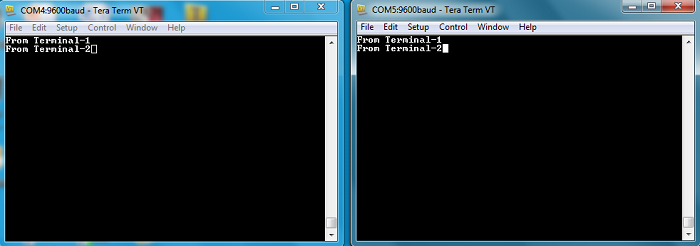

# CDC COM Port Dual Example \(cdc\_com\_port\_dual\)

This application demonstrates the ability of the MPLAB Harmony USB Device Stack to  support multiple instances of the same device class. It creates a USB CDC Device that  enumerates as two serial ports on the USB Host PC.

## **Description**

This application is example of a USB CDC Device that enumerates as a dual COM port on  the USB host PC. The COM port can be opened using any of the terminal applications.  To demonstrate communication between the two COM ports, a character typed in one of  the COM port is displayed on the other and vice versa.

## **Downloading and building the application**

To clone or download this application from Github, go to the [main page of this repository](https://github.com/Microchip-MPLAB-Harmony/usb_apps_device) and then click **Clone**  button to clone this repository or download as zip file. This content can also be  downloaded using content manager by following these [instructions](https://github.com/Microchip-MPLAB-Harmony/contentmanager/wiki).

Path of the application within the repository is [usb\_apps\_device/apps/cdc\_com\_port\_dual](https://github.com/Microchip-MPLAB-Harmony/usb_apps_device/tree/master/apps/cdc_com_port_dual).

Following table gives the details of project configurations, target device  used, hardware and its IDE. Open the project using the respective IDE and build  it.

|Project Name|IDE|Target Device|Hardware / Configuration|
|------------|---|-------------|------------------------|
|sam\_9x75\_eb.X|MPLABX|SAM9X75|SAM9X75-DDR3-EB Evaluation Board|
|sam\_9x60\_curiosity.X|MPLABX|SAM9X60|SAM9X60 Curiosity Development Board|
|sam\_d11\_xpro.X|MPLABX|ATSAMD11D14A|SAMD11 Xplained Pro board|
|sam\_d21\_xpro.X|MPLABX|ATSAMD21J18A|SAMD21 Xplained Pro board|
|sam\_a7g5\_ek.X|MPLABX|SAMA7G54|SAMA7G5 EK Board|
|sam\_e54\_xpro.X|MPLABX|ATSAME54P20A|SAME54 Xplained Pro board|
|sam\_e54\_xpro\_freertos.X|MPLABX|ATSAME54P20A|SAME54 Xplained Pro board|
|sam\_e70\_xult.X|MPLABX|ATSAME70Q21B|SAME70 Xplained Ultra board|
|sam\_e70\_xult\_freertos.X|MPLABX|ATSAME70Q21B|SAME70 Xplained Ultra board|
|sam\_v71\_xult.X|MPLABX|ATSAMV71Q21B|SAMV71 Xplained Ultra board|
|sam\_v71\_xult\_freertos.X|MPLABX|ATSAMV71Q21B|SAMV71 Xplained Ultra board|
|pic32mz\_ef\_curiosity\_2\_0.X|MPLABX|PIC32MZ2048EFM144|Curiosity PIC32MZ EF 2.0 Development Board|
|pic32mx470\_curiosity.X|MPLABX|PIC32MX470F512H|PIC32MX Curiosity Development Board|
|pic32mm\_usb\_curiosity.X|MPLABX|PIC32MM0256GPM064|PIC32MM USB Curiosity Development Board|
|pic32cz\_ca80\_curiosity\_ultra.X|MPLABX|PIC32CZ8110CA80208|PIC32CZ CA80 Curiosity Ultra development board|
|pic32ck\_gc01\_curiosity\_ultra.X|MPLABX|PIC32CK2051GC01144|PIC32CK GC Curiosity Ultra Development Board|
|pic32cx\_sg41\_curiosity\_ultra.X|MPLABX|PIC32CX1025SG41128|PIC32CX SG41 Curiosity Ultra Evaluation Board|
|sam\_a5d29\_curiosity.X|MPLABX|ATSAMA5D29|SAMA5D29 Curiosity Development Board|
|sam\_9x75\_curiosity.X|MPLABX|SAM9X75D2G|SAM9X75-Curiosity Development Board|
|sam\_a7d65\_curiosity.X|MPLABX|SAMA7D65|SAMA7D65 Curiosity Development Board|

## **Configuring the Hardware**

**[SAMD11 Xplained Pro board](https://www.microchip.com/developmenttools/ProductDetails/atsamd11-xpro)**

-   Use TARGET USB connector on the board to connect the USB Device to the USB Host PC.
-   LED0 indicates USB Device Configuration Set Complete event \(the USB device functionality has been activated by the USB Host\).

**[SAMD21 Xplained Pro board](https://www.microchip.com/developmenttools/ProductDetails/atsamd21-xpro)**

-   Use TARGET USB connector on the board to connect the USB Device to the USB Host PC.
-   LED0 indicates USB Device Configuration Set Complete event \(the USB device functionality has been activated by the USB Host\).

**[SAME54 Xplained Pro board](https://www.microchip.com/developmenttools/productdetails/atsame54-xpro)**

-   Use TARGET USB connector on the board to connect the USB Device to the USB Host PC.
-   LED0 indicates USB Device Configuration Set Complete event \(the USB device functionality has been activated by the USB Host\).

**[SAME70 Xplained Ultra board](https://www.microchip.com/DevelopmentTools/ProductDetails/PartNO/DM320113)**

-   Jumper J203 must be shorted between PB08 and VBUS \(positions 2 and 3\).
-   Use TARGET USB J200 connector on the board to connect the USB Device to the USB Host PC.
-   LED3 indicates USB Device Configuration Set Complete event \(the USB device functionality has been activated by the USB Host\).

**[SAMV71 Xplained Ultra board](https://www.microchip.com/DevelopmentTools/ProductDetails/PartNO/ATSAMV71-XULT)**

-   Jumper titled "USB VBUS" must be shorted between PC09 and VBUS \(positions 2 and 3\)
-   Use TARGET USB connector on the board to connect the USB Device to the USB Host PC.
-   LED0 indicates USB Device Configuration Set Complete event \(the USB device functionality has been activated by the USB Host\).

**[PIC32CZ CA80 Curiosity Ultra development board](https://www.microchip.com/en-us/development-tool/ea61x20a)**

-   Use the USB micro-B connector \(J102\) to connect the USB Device to the USB Host PC.
-   LED0 indicates USB Device Configuration Set Complete event \(The USB device functionality has been activated by the USB Host\).

**[PIC32CK GC Curiosity Ultra Development Board](https://www.microchip.com/en-us/development-tool/ea23j82a)**

-   Use the Barrel jack connector\(J200\) to connect an external power supply to the board.
-   Use the USB Type-c connector \(J202\) to connect the USB Device to the USB Host PC.
-   LED0 indicates USB Device Configuration Set Complete event \(The USB device functionality has been activated by the USB Host\).

**[PIC32CX SG41 Curiosity Ultra Evaluation Board](https://www.microchip.com/en-us/development-tool/ev06x38a)**

-   Use the micro-B USB connector TARGET USB\( J200\) on the board to connect the USB Device to the USB Host PC.
-   LED1 indicates USB Device Configuration Set Complete event \(the USB device functionality has been activated by the USB Host\).

**[Curiosity Pro PIC32CM LE00 Development Board](https://www.microchip.com/en-us/development-tool/EV80P12A)**

-   Use the USB micro-A/B "TARGET USB" connector \(D200\) to connect the USB Device to the USB Host PC.
-   LED0 indicates USB Device Configuration Set Complete event \(the USB device functionality has been activated by the USB Host\).

**[Curiosity PIC32MZ EF 2.0 Development Board](https://www.microchip.com/developmenttools/ProductDetails/DM320209)**

-   Use the USB micro-B port J201 to connect the USB Device to the USB Host PC.
-   LED1 indicates USB Device Configuration Set Complete event \(the USB device functionality has been activated by the USB Host\).

**[Curiosity PIC32MX470 Development Board](https://www.microchip.com/Developmenttools/ProductDetails/dm320103)**

-   Use the USB micro-B port J12 to connect the USB Device to the USB Host PC.
-   LED1 indicates USB Device Configuration Set Complete event \(the USB device functionality has been activated by the USB Host\).

**[PIC32MM USB Curiosity Development Board](https://www.microchip.com/en-us/development-tool/dm320107)**

-   Use the micro-B USB connector USB2 on the board to connect the USB Device to the USB Host PC.
-   LED1 indicates USB Device Configuration Set Complete event \(the USB device functionality has been activated by the USB Host\).

**[SAM9X75-DDR3-EB Evaluation Board](https://www.microchip.com/en-us/development-tool/EA14J50A)**

-   Powered the board with an external power supply \(or use the  micro AB connector\).

-   Setup the SD card \(Note: exFAT formatted SD Cards are not  supported\)

    -   Download harmony MPU bootstrap loader from this [location](https://github.com/Microchip-MPLAB-Harmony/usb_apps_device/tree/master/deps/at91bootstrap_sam_9x7_binaries/boot.bin).
    -   Copy the downloaded boot loader binary \(boot.bin\) and generated application binary \(harmony.bin\) into the SD card.
    -   Insert the SD card into the SDMMC connector \(SDMMC0\) on the board.
    -   Reset the board by pressing the Push Button RESET, then START.
-   Connect the USB Micro-AB Connector on the board to the computer  using a micro USB cable.

-   LED near VDDCORE inscription on the board indicates USB Device  Configuration Set Complete event \(The USB device functionality has been  activated by the USB Host\).

**[SAMA7G5-EK Evaluation Kit](https://www.microchip.com/en-us/development-tool/EV21H18A)**

-   Powered the board with an external power supply \(J1\) or power supply the board by connecting J7 to the computer using a micro USB cable.
-   Setup the SD card \(Note: exFAT formatted SD Cards are not supported\)
    -   Download harmony MPU bootstrap loader from this [location](https://github.com/Microchip-MPLAB-Harmony/usb_apps_device/tree/master/deps/at91bootstrap_sam_a7g5_binaries/boot.bin).
    -   Copy the downloaded boot loader binary \(boot.bin\) and generated application binary \(harmony.bin\) into the SD card.
    -   Insert the SD card into the SD Card Connector \(J4\) on the board.
    -   Reset the board by pressing the Reset Button \(nRST\)
-   Press the "nSTART" button to activate board start-up.
-   Connect the USB MicroAB connector \(J7\) to the computer using an USB cable.
-   RGB LED turning to Green indicates USB Device Configuration Set Complete event \(The USB device functionality has been activated by the USB Host\).

**[SAM9X60-Curiosity Board](https://www.microchip.com/en-us/development-tool/EV40E67A)**

-   Setup the SD card \(Note: exFAT formatted SD Cards are not supported\)
    -   Download harmony MPU bootstrap loader from this [location](https://github.com/Microchip-MPLAB-Harmony/usb_apps_device/tree/master/deps/at91bootstrap_sam_9x60_binaries/boot.bin).
    -   Copy the downloaded boot loader binary \(boot.bin\) and generated application binary \(harmony.bin\) into the SD card.
    -   Insert the SD card into the SDMMC0 connector J3 on the board.
    -   Reset the board by pressing the Push Button RESET.
-   Jumper J4 must be shorted.
-   Connect the USB Micro-B Connector \(J1\) on the board to the computer using a micro USB cable.
-   LED D1 indicates USB Device Configuration Set Complete event \(The USB device functionality has been activated by the USB Host\).

**[SAMA5D29 Curiosity Development Board](https://www.microchip.com/en-us/development-tool/ev07r15a)**

-   Setup the SD card \(Note: exFAT formatted SD Cards are not supported\)
    -   Download harmony MPU bootstrap loader from this [location](https://github.com/Microchip-MPLAB-Harmony/usb_apps_device/tree/master/deps/at91bootstrap_sam_a5d29_binaries/boot.bin).
    -   Copy the downloaded boot loader binary \(boot.bin\) and generated application binary \(harmony.bin\) into the SD card.
    -   Insert the SD card into the μSD-CARD connector \(J6\) on the board.\(This connector is present on the bottom face of the board\)
    -   Reset the board by pressing the Push Button RESET.
-   Press the "START" button to activate board start-up.
-   Connect the USB Type-C \(USB-A\) Connector \(J1\) on the board to the computer using a USB Type-C cable.
-   RGB LED \(D5\) turning to Green indicates USB Device Configuration Set Complete event \(The USB device functionality has been activated by the USB Host\).

**SAM9X75-Curiosity Development Board**

-   Setup the SD card \(Note: exFAT formatted SD Cards are not supported\)
    -   Download harmony MPU bootstrap loader from this [location](https://github.com/Microchip-MPLAB-Harmony/usb_apps_device/tree/master/deps/at91bootstrap_sam_9x75_curiosity_binaries/boot.bin).
    -   Copy the downloaded boot loader binary \(boot.bin\) and generated application binary \(harmony.bin\) into the SD card.
    -   Insert the SD card into the μSD-CARD connector \(J14\) on the board.
    -   Reset the board by pressing the Push Button RESET.
-   Press the "START" button to activate board start-up.
-   Connect the USB Micro-B \(USB\_A\) Connector \(J2\) on the board to the computer using a USB cable.
-   RGB LED \(LD1\) turning to Green indicates USB Device Configuration Set Complete event \(The USB device functionality has been activated by the USB Host\).

**[SAMA7D65 Curiosity Development Board](https://www.microchip.com/en-us/development-tool/ea89c15a#Overview)**

-   Setup the SD card \(Note: exFAT formatted SD Cards are not supported\)
    -   Download harmony MPU bootstrap loader from this [location](https://github.com/Microchip-MPLAB-Harmony/usb_apps_device/tree/master/deps/at91bootstrap_sam_a7d65_curiosity/boot.bin).
    -   Copy the downloaded boot loader binary \(boot.bin\) and generated application binary \(harmony.bin\) into the SD card.
    -   Insert the SD card into the SD-CARD connector \(J10\) on the board.
    -   Reset the board by pressing the Push Button RESET.

-   Press the "START" button to activate board start-up.
-   Connect the USB Type-C Connector \(J3\) on the board to the computer using a USB cable.
-   RGB LED turning to Green indicates USB Device Configuration Set Complete event \(The USB device functionality has been activated by the USB Host\).

## **Running the Application**

This demonstration creates a USB device that enumerates as two serial \(COM\)  ports on the host. Do the following to run this demonstration:

1.  Open the project with appropriate IDE. Compile the project and  program the target device.

2.  Attach the device to the host. If the host is a personal  computer and this is the first time you have plugged this device into the  computer you may be prompted for a .inf file

    

3.  Select the "Install from a list or specific location \(Advanced\)" option. Navigate to the driver path available in the repo - *..\\usb\_apps\_device\\apps\\cdc\_com\_port\_dual\\inf*. Note: To specifically select the driver, open the *Device Manager* and expand the Ports \(COM & LPT\) tab, and right click on *Update Driver Software*.Verify that the enumerated USB device is seen as a virtual USB serial comport in Device Manager .

    

    **NOTE:** The LEDs on the demonstration board will indicate the  USB state of the device. Refer to the [Configuring the Hardware](https://file+.vscode-resource.vscode-cdn.net/c%3A/H3_USB_APPS/usb_apps_device/apps/cdc_com_port_dual/readme.md#config_title) section  for the selected target hardware.

4.  Once the device is successfully installed and visible on the  *Device Manager*, open two instances of terminal program, such as  HyperTerminal and select the appropriate COM port. Set the serial port  settings as follows:

    -   Baud : 9600
    -   Data : 8 Bits
    -   Parity : None
    -   Stop : 1 Bit
    -   Flow Control : None
    **Note:** The baud rate can be different from 9600 but the  chosen value has to be the same on both the instances of terminal  program

    .

5.  To run the demonstration, turn on local echo on both the terminals. If the terminal application is Tera Term, navigate to Setup-\>Terminal to turn on local echo. Type a character or string in one terminal window. The same character or string shall appear on the second terminal window and vice versa. The following screen shot shows two instances of Tera Term.**Note:** Some terminal programs, like HyperTerminal, require users to click the disconnect button before removing the device from the computer. Failing to do so may result in having to close and open the program again to reconnect to the device.

**Parent topic:**[Harmony 3 USB Device application examples](GUID-90055758-897E-445A-8A8B-CE4EBF3930A7.md)

